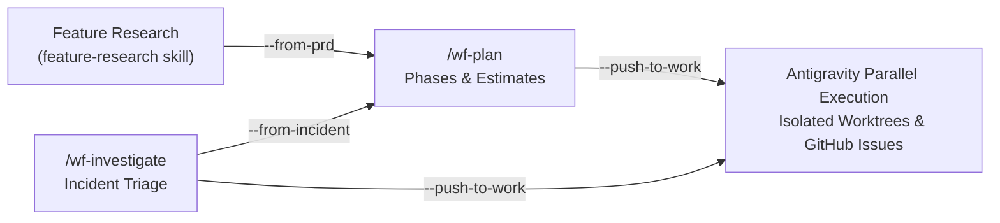

# Workforces

A lean, portable AI toolkit containing modernized subagents, modular skills, native lifecycle hooks, and behavioral rules.

---

## Workforce vs. Project

When installing this toolkit, you'll choose a **type** that describes the role of the target repository:

### Project (`--type project`)
A **standard codebase** where you're doing the actual work — writing code, shipping features, fixing bugs. Most repos fall into this category (e.g. a web app, API service, or internal tool).

Installing the toolkit into a project repo gives your AI assistant full context about that codebase: its goals, GitHub queue, and team preferences. The `workforces/` workspace folder tracks state and goals *scoped to that project*.

### Workforce (`--type workforce`)
A **central coordinator repo** that tracks and manages multiple project repos. It's not where code gets written — it's the command center. A workforce-type install is appropriate when the repo's purpose is to orchestrate tasks, maintain shared knowledge, or manage cross-project planning across an entire team or product portfolio.

> **In short:** a *project* is where work happens; a *workforce* is what coordinates across many projects.

---

## Toolkit Structure

When installed, the toolkit separates static agent assets (the **Toolkit Layer**) from your runtime states and configurations (the **Workspace Layer**):

```
.agents/               ← Toolkit Layer (automatically updated, read-only)
├── agents/            ← Subagent personas with official Antigravity schema (e.g., project-manager.md)
├── skills/            ← Modular agent skills with rich semantic discovery (e.g., wf-plan/, clean-coder/)
├── rules/             ← Always-on behavioral rules (e.g., base.md)
├── plugins/           ← Domain plugin bundles (e.g., workforce-programming-plugin/)
└── hooks.json         ← Native lifecycle hooks (PreToolUse / PostToolUse)

workforces/            ← Workspace Layer (user-owned configuration and state)
├── README.md          ← Workspace overview
├── workrules.md       ← User configurations, settings, and response preferences
├── workstate.md       ← Workspace tracking state
├── goals/             ← RICE-scored blueprints and goals
└── team-sync/         ← YYYY-MM-DD.md files documenting standups and syncs
```

---

## Installation Guide

### For AI Assistants (Autopilot Install)
If you are an AI assistant (Antigravity, Claude Code, VS Code Copilot, or Grok Build) tasked with installing this repo:
1. Clone this repository to `/tmp/workforces`.
2. Inspect the host environment and run:
   ```bash
   bash /tmp/workforces/skills/workforce-management/scripts/setup.sh ./ --editor <editor-type> --type <repo-type> --non-interactive
   ```
   *Replace `<editor-type>` with `antigravity`, `vscode`, `claude`, or `grok` depending on the user's workspace profile, and `<repo-type>` with `project` or `workforce`. Grok Build notes: [docs/grok.md](docs/grok.md).*
3. Configure the user's response preferences inside `workforces/workrules.md` under `## AI Preferences`.

### For Humans (Manual Install)
```bash
git clone https://github.com/wedigcode/workforces.git /tmp/workforces
bash /tmp/workforces/skills/workforce-management/scripts/setup.sh ./
rm -rf /tmp/workforces
```
For more setup options and environment configuration, see the [Setup Guide](docs/setup.md).

---

## Core Components

### Skills
| Skill | Description |
|-------|-------------|
| [`code-graph`](skills/code-graph/SKILL.md) | Zero-dependency symbol indexer, function call graph mapper, and pre-hook impact analyzer |
| [`post-code-review`](skills/post-code-review/SKILL.md) | Whole-codebase post-hook quality reviewer and blast-radius evaluator |
| [`site-setup`](skills/site-setup/SKILL.md) | Greenfield site initialization, multi-team handoffs, scaffolding safeguards, and brief generation |
| [`ai-search-optimization`](skills/ai-search-optimization/SKILL.md) | Framework-aware GEO readiness: llms.txt, robots.txt, ai.txt, ai-plugin.json, and sitemaps |
| [`image-workflow`](skills/image-workflow/SKILL.md) | Image planning queue in `workforces/images.json`, Antigravity `generate_image`, and optimization |
| [`memory-management`](skills/memory-management/SKILL.md) | Protocol for navigating OKF catalogs and managing workspace memories |
| [`github-project-planning`](skills/github-project-planning/SKILL.md) | Create/update GitHub issues and interact with Project V2 boards |
| [`workforce-management`](skills/workforce-management/SKILL.md) | Update, patch, and align settings for the Workforces toolkit |
| [`business-frameworks`](skills/business-frameworks/SKILL.md) | Contemporary MBA strategy frameworks, Value Stick, JTBD, Growth Loops, and SaaS unit economics |
| [`feature-research`](skills/feature-research/SKILL.md) | Research-first pipeline: gap analysis, PRD, and work breakdown across projects |
| [`usage-tracker`](skills/usage-tracker/SKILL.md) | Real-time token, character, thought, and subagent usage tracking across agent sessions |

### Agents & Team Roster
Full roster documentation available in [`docs/teams-and-agents.md`](docs/teams-and-agents.md).

| Agent Tag | Role / Domain | Core Capabilities |
| :--- | :--- | :--- |
| [`@project-manager`](agents/project-manager.md) | Project Manager | Backlog prioritization, Value Stick scoring, SaaS unit economics, and GitHub sync |
| [`@programmer`](agents/programmer.md) | Software Engineer | Clean code authoring, TDD, symbol graph index lookup, and post-edit reviews |
| [`@designer`](agents/designer.md) | Visual & UI/UX Designer | Visual concept ideation, design tokens, layout specifications, and design QA reviews |
| [`@marketer`](agents/marketer.md) | Marketer | JTBD positioning, Connected Strategy models, PAS copywriting, and closed growth loops |
| [`@sales`](agents/sales.md) | Sales Specialist | Prospect research, JTBD discovery, Customer Delight ROI framing, and closing |
| [`@social`](agents/social.md) | Social Engager | Content discovery, cold-post triage, and high-engagement reply catalysts |
| [`@growth`](agents/growth.md) | Growth & SEO Lead | Intent matching, programmatic SEO, closed growth loops, and platform network effects |
| [`@operations`](agents/operations.md) | Operations Lead | Metrics dashboards, telemetry tracking, sprint velocity, and workforce state |
| [`@researcher`](agents/researcher.md) | Feature Researcher | Gap analysis, competitive teardowns, and structured PRD specifications |
| [`@scribe`](agents/scribe.md) | Scribe | Zero-narrative session context recording and architectural persistence |
| [`@launcher`](agents/launcher.md) | Launch Specialist | High-velocity pre-sales, concierge MVPs, painted doors, Stripe rails, and sprints to first dollar (TTFD) |
| [`@unbundler`](agents/unbundler.md) | Micro-SaaS Architect | Incumbent software unbundling, single-feature micro-SaaS opportunities, and zero-bloat PRDs |
| [`@disruptor`](agents/disruptor.md) | Disruption Scout | Million-dollar market gaps, macro consulting trend synthesis (McKinsey/BCG/Bain), and lean validation tests |

### Interactive Slash Commands (`/wf-*`)
Workforces registers 6 core interactive command-center entrypoints in Antigravity:

| Slash Command | Skill Directory | Description |
|---|---|---|
| `/wf-sync` | [`wf-sync`](skills/wf-sync/SKILL.md) | Multi-mode sync: daily standup (`--daily`), strategy review (`--strategy`), goals (`--goals`), & personal radar (`--me`) |
| `/wf-plan` | [`wf-plan`](skills/wf-plan/SKILL.md) | Phased project planning, RICE scoring, task breakdown, estimates, and execution topology selection |
| `/wf-advisor` / `/wf-consult` | [`wf-advisor`](skills/wf-advisor/SKILL.md) | Strategic advisory, consultative problem discovery & trade-off evaluation |
| `/wf-ideate` | [`wf-ideate`](skills/wf-ideate/SKILL.md) | Rapid ideation, atomic micro-SaaS unbundling, and market disruption exploration |
| `/wf-investigate` | [`wf-investigate`](skills/wf-investigate/SKILL.md) | Incident triage, log streaming to scratch, postmortem generation |
| `/wf-question-formulation` | [`wf-question-formulation`](skills/wf-question-formulation/SKILL.md) | Formulate high-leverage questions with trade-offs before escalating decisions |

### Modular Domain & Agent Skills
Specialist capabilities invoked autonomously by agents, coordinators, or natural prompts:

| Skill | Directory | Description & Invocation |
|---|---|---|
| **Codebase Improvement** | [`codebase-improvement`](skills/codebase-improvement/SKILL.md) | 5-pillar code quality audit & hygiene (`codebase-improvement` or prompt) |
| **Site Setup** | [`site-setup`](skills/site-setup/SKILL.md) | Greenfield site setup & Product Brief pipeline (`site-setup` or prompt) |
| **Feature Research** | [`feature-research`](skills/feature-research/SKILL.md) | Multi-phase scoping, gap analysis, and PRD generation (`feature-research` or prompt) |
| **Clean Coder & Graph** | [`clean-coder`](skills/clean-coder/SKILL.md) · [`code-graph`](skills/code-graph/SKILL.md) | TDD mindset, symbol lookup, deduplication, and AST call graphs |
| **Brand Guidelines** | [`brand-guidelines`](skills/brand-guidelines/SKILL.md) | Brand voice, palette, typography, and `docs/brand-context.md` |
| **Launch & Validation** | [`launch-playbook`](skills/launch-playbook/SKILL.md) · [`market-validation`](skills/market-validation/SKILL.md) | Pre-sale painted doors, TTFD/TTOU metrics, and rapid pretotyping |
| **Task & Issue Tracking** | [`task-tracker`](skills/task-tracker/SKILL.md) · [`issue-tracker`](skills/issue-tracker/SKILL.md) | Deferred task capture, lifecycle tracking, and session lineage |
| **Session Context** | [`session-context`](skills/session-context/SKILL.md) | Cross-session context preservation and zero-narrative scribe persistence |
| **Social Engagement** | [`social-engagement`](skills/social-engagement/SKILL.md) | Anti-bot community engagement, cold-post triage, and action dashboard |
| **Integrity Validator** | [`integrity-validator`](skills/integrity-validator/SKILL.md) | Reference lineage enforcement and link verification (`validate-references.py`) |
| **Workforce Canvas** | [`workforce-canvas`](skills/workforce-canvas/SKILL.md) | Interactive node-based visual command canvas daemon (`server.py`) |
| **Workforce Management** | [`workforce-management`](skills/workforce-management/SKILL.md) | Toolkit updates, team pack installation, and reference-counted pruning |

### Native Lifecycle Hooks (`hooks.json`)
The toolkit integrates native lifecycle hooks distributed to `.agents/hooks.json` to enforce quality without relying solely on system prompts:
- **`PreToolUse`**: Automatically triggers `code-graph` symbol verification prior to file edits.
- **`PostToolUse`**: Automatically runs `post_code_reviewer.py` to audit diffs, swallowed errors, and contract boundaries after tool calls.

---

## Integrated Skill Pipeline

The toolkit connects feature research, planning, incident triage, and execution into a cohesive, hands-off pipeline:



### End-to-End Skill Lifecycles

1. **Feature Scoping ➔ Planning ➔ Execution**
   - **Research & Spec**: Run feature research (`feature-research` skill) to run gap analysis and output a PRD (`docs/prd-*.md`).
   - **Phase & Estimate**: Run `/wf-plan --from-prd docs/prd-feature.md` to split the PRD into deployable phases, tasks, and time estimates.
   - **Push to Execution**: Use the `--push-to-work` flag (or accept the prompt) to sync Phase 1 tasks into `workforces/workstate.md` and create tracked GitHub issues.
   - **Execute**: Run parallel subagents via `agent-parallelization` (isolated worktrees in `.worktrees/<slug>`) or review active tasks via `/wf-sync`.

2. **Incident Triage ➔ Remediation**
   - **Triage & Diagnose**: Run `/wf-investigate [service-name]` to stream logs into workspace scratch space (`workforces/tmp/`), classify root cause, and generate a postmortem (`workforces/incidents/`).
   - **Remediate**: Pass `--push-to-work` to push P0/P1 fixes into your active tasks, or run `/wf-plan --from-incident` to build a full remediation plan.

---

## Updating

Update the installed toolkit using the built-in updater script or command:

```bash
# Preview modifications
bash .agents/skills/workforce-management/scripts/update.sh ./ --dry

# Apply updates (prunes obsolete workflows and updates skills/hooks)
bash .agents/skills/workforce-management/scripts/update.sh ./
```

Or ask your AI assistant: *"Update the workforces toolkit"* or *"Check for updates"*.
