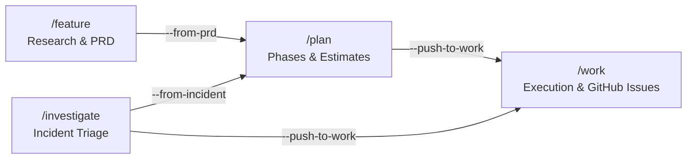

# Workforces

A lean, portable AI toolkit containing agent personas, slash-command workflows, reusable skills, and behavioral rules.

---

## Workforce vs. Project

When installing this toolkit, you'll choose a **type** that describes the role of the target repository:

### Project (`--type project`)
A **standard codebase** where you're doing the actual work — writing code, shipping features, fixing bugs. Most repos fall into this category (e.g. a web app, API service, or internal tool).

Installing the toolkit into a project repo gives your AI assistant full context about that codebase: its goals, GitHub queue, and team preferences. The `workforces/` workspace folder tracks state and goals *scoped to that project*.

### Workforce (`--type workforce`)
A **central coordinator repo** that tracks and manages multiple project repos. It's not where code gets written — it's the command center. A workforce-type install is appropriate when the repo's purpose is to orchestrate tasks, maintain shared knowledge, or manage cross-project planning across an entire team or product portfolio.

> **In short:** a *project* is where work happens; a *workforce* is what coordinates across many projects.

---

## Toolkit Structure

When installed, the toolkit separates static agent assets (the **Toolkit Layer**) from your runtime states and configurations (the **Workspace Layer**):

```
.agents/               ← Toolkit Layer (automatically updated, read-only)
├── agents/            ← Specialist agent personas (e.g., project-manager.md)
├── workflows/         ← Slash-command workflows (e.g., work.md)
├── skills/            ← Reusable skill modules (e.g., workforce-management/)
└── rules/             ← Always-on rules (e.g., base.md)

workforces/            ← Workspace Layer (user-owned configuration and state)
├── README.md          ← Workspace overview
├── workrules.md       ← User configurations, settings, and response preferences
├── workstate.md       ← Workspace tracking state
├── goals/             ← RICE-scored blueprints and goals
└── team-sync/         ← YYYY-MM-DD.md files documenting standups and syncs
```

---

## Installation Guide

### For AI Assistants (Autopilot Install)
If you are an AI assistant (Antigravity, Claude Code, VS Code Copilot, or Grok Build) tasked with installing this repo:
1. Clone this repository to `/tmp/workforces`.
2. Inspect the host environment and run:
   ```bash
   bash /tmp/workforces/skills/workforce-management/scripts/setup.sh ./ --editor <editor-type> --type <repo-type> --non-interactive
   ```
   *Replace `<editor-type>` with `antigravity`, `vscode`, `claude`, or `grok` depending on the user's workspace profile, and `<repo-type>` with `project` or `workforce`. Grok Build notes: [docs/grok.md](docs/grok.md).*
3. Configure the user's response preferences inside `workforces/workrules.md` under `## AI Preferences`.

### For Humans (Manual Install)
```bash
git clone https://github.com/wedigcode/workforces.git /tmp/workforces
bash /tmp/workforces/skills/workforce-management/scripts/setup.sh ./
rm -rf /tmp/workforces
```
For more setup options and environment configuration, see the [Setup Guide](docs/setup.md).

---

## Core Components

### Skills
| Skill | Description |
|-------|-------------|
| [`code-graph`](skills/code-graph/SKILL.md) | Zero-dependency symbol indexer, function call graph mapper, and pre-hook impact analyzer |
| [`post-code-review`](skills/post-code-review/SKILL.md) | Whole-codebase post-hook quality reviewer and blast-radius evaluator |
| [`site-setup`](skills/site-setup/SKILL.md) | Greenfield site initialization, multi-team handoffs, scaffolding safeguards, and brief generation |
| [`ai-search-optimization`](skills/ai-search-optimization/SKILL.md) | Framework-aware GEO readiness: llms.txt, robots.txt, ai.txt, ai-plugin.json, and sitemaps |
| [`image-workflow`](skills/image-workflow/SKILL.md) | Image planning queue in `workforces/images.json`, Antigravity `generate_image`, and optimization |
| [`memory-management`](skills/memory-management/SKILL.md) | Protocol for navigating OKF catalogs and managing workspace memories |
| [`github-project-planning`](skills/github-project-planning/SKILL.md) | Create/update GitHub issues and interact with Project V2 boards |
| [`workforce-management`](skills/workforce-management/SKILL.md) | Update, patch, and align settings for the Workforces toolkit |
| [`feature-research`](skills/feature-research/SKILL.md) | Research-first pipeline: gap analysis, PRD, and work breakdown across projects |
| [`usage-tracker`](skills/usage-tracker/SKILL.md) | Real-time token, character, thought, and subagent usage tracking across agent sessions |

### Agents & Team Roster
Full roster documentation available in [`docs/teams-and-agents.md`](docs/teams-and-agents.md).

| Agent Tag | Role / Domain | Core Capabilities |
| :--- | :--- | :--- |
| [`@advisor`](agents/advisor.md) | Strategic Advisor | Consultative problem discovery, root cause extraction, and trade-off coaching |
| [`@project-manager`](agents/project-manager.md) | Project Manager | Backlog prioritization, task sequencing, sprint syncs, and GitHub project sync |
| [`@programmer`](agents/programmer.md) | Software Engineer | Clean code authoring, TDD, symbol graph index lookup, and post-edit reviews |
| [`@designer`](agents/designer.md) | Visual & UI/UX Designer | Visual concept ideation, design tokens, layout specifications, and design QA reviews |
| [`@marketer`](agents/marketer.md) | Marketer | Positioning, PAS/AIDA copywriting, email nurture funnels, and launch campaigns |
| [`@sales`](agents/sales.md) | Sales Specialist | Prospect research, multi-touch outbound cadences, qualification, and closing |
| [`@social`](agents/social.md) | Social Engager | Content discovery, cold-post triage, and high-engagement reply catalysts |
| [`@growth`](agents/growth.md) | Growth & SEO Lead | Intent matching, programmatic SEO, and Generative Engine Optimization (GEO/AISO) |
| [`@operations`](agents/operations.md) | Operations Lead | Metrics dashboards, telemetry tracking, sprint velocity, and workforce state |
| [`@compliance`](agents/compliance.md) | Compliance Auditor | Reference lineage enforcement, zero ghost references, and policy compliance |
| [`@researcher`](agents/researcher.md) | Feature Researcher | Gap analysis, competitive teardowns, and structured PRD specifications |
| [`@scribe`](agents/scribe.md) | Scribe | Zero-narrative session context recording and architectural persistence |

### Workflows
| Command | Workflow | Description |
|---------|----------|-------------|
| `/work` | [`work`](workflows/work.md) | Single command center: scans GitHub queue, surfaces top active tasks |
| `/advisor` / `/consult` | [`advisor`](workflows/advisor.md) | Strategic advisory, consultative problem discovery & trade-off evaluation |
| `/work site-setup` / `/site-setup` | [`site-setup`](workflows/site-setup.md) | Greenfield site setup & Product Brief pipeline with `@advisor` and `@designer` |
| `/brand-context` | [`brand-context`](workflows/brand-context.md) | Brand identity foundation: voice, palette, typography, and tokens |
| `/work feature` / `/feature` | [`feature`](workflows/feature.md) | Multi-phase feature scoping, problem discovery, gap analysis, PRD generation |
| `/work plan` / `/plan` | [`plan`](workflows/plan.md) | Phased project planning, task breakdown, estimates, and risk matrix |
| `/work investigate` / `/investigate` | [`investigate`](workflows/investigate.md) | Incident triage, log streaming to scratch, postmortem generation |
| `/work sync` | [`sync`](workflows/sync.md) | Aligns on wins, losses, next goals, and blockers; logs daily syncs |
| `/update-workforces` | [`update-workforces`](workflows/update-workforces.md) | Dry-run, patch toolkit layer files, and summarize updates |


---

## Integrated Workflow Pipeline

The toolkit connects feature research, planning, incident triage, and execution into a cohesive, hands-off pipeline:



### End-to-End Workflow Lifecycles

1. **Feature Scoping ➔ Planning ➔ Execution**
   - **Research & Spec**: Run `/feature "Feature Idea"` (or `/work feature`) to run gap analysis and output a PRD (`docs/prd-*.md`).
   - **Phase & Estimate**: Run `/work plan --from-prd docs/prd-feature.md` to split the PRD into deployable phases, tasks, and time estimates.
   - **Push to Execution**: Use the `--push-to-work` flag (or accept the prompt) to sync Phase 1 tasks into `workforces/workstate.md` and create tracked GitHub issues.
   - **Execute**: Run `/work` to view the queue and execute the top priority task.

2. **Incident Triage ➔ Remediation**
   - **Triage & Diagnose**: Run `/investigate [service-name]` (or `/work investigate`) to stream logs into workspace scratch space (`workforces/tmp/`), classify root cause, and generate a postmortem (`workforces/incidents/`).
   - **Remediate**: Pass `--push-to-work` to push P0/P1 fixes into your active tasks, or run `/plan --from-incident` to build a full remediation plan.

---

## Updating

Update the installed toolkit using the built-in update workflow:

```bash
# Preview modifications
bash .agents/skills/workforce-management/scripts/update.sh ./ --dry

# Apply updates
bash .agents/skills/workforce-management/scripts/update.sh ./
```

Or ask your AI assistant: `/update-workforces`.
