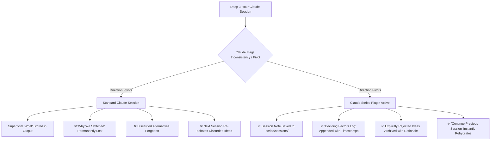
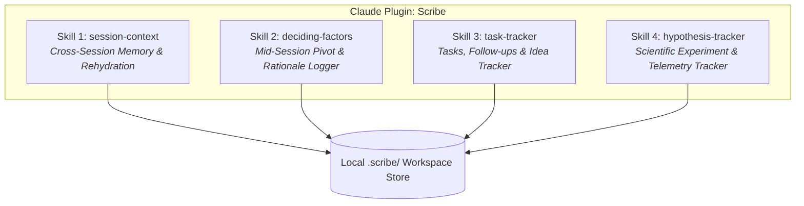

# Product Requirement Document (PRD): Claude Scribe Plugin
**Project Name:** Claude Scribe (`claude-scribe`)  
**Package / Plugin Type:** Native Claude Plugin (under Claude Desktop / Web `Customize > Plugins`)  
**Tagline:** *Zero-Narrative Session Memory, Deciding Factors Log & Hypothesis Engine for Claude*  
**Document Status:** Approved & Ready for Implementation  
**Target Release Platforms:** Claude Desktop, Claude Web App (Claude.ai), and Claude Projects via Native Plugins & Skills Architecture  

---

## 1. Executive Summary & Problem Diagnosis

### 1.1 The Context Cliff & Memory Degradation Problem
When builders, engineers, and founders engage in long, productive AI conversations (e.g. 2–3 hour architectural deep-dives in Claude Desktop or Claude Projects), they inevitably hit the **context window ceiling** (~80% token capacity).

Users currently attempt manual workarounds:
- **"Brain Saves" & Handoff Prompts:** Asking Claude to summarize the chat, then manually copying and pasting the summary into a fresh chat session.
- **Lost Spontaneous Ideas:** Great secondary ideas, discovered bugs, edge cases, and tech debt identified during execution get lost in the chat transcript.
- **Untracked Growth Bets:** Speculative features or outreach tactics are casually brainstormed and either forgotten or mistakenly treated as established facts.

### 1.2 The Core Leak: "The Mid-Session Pivot"
The single biggest failure mode in existing AI memory tools is **mid-session pivots**:
> *“Claude asks a sharp question or flags an architectural inconsistency. We change direction, and the original options and features get left behind. The ‘what’ sometimes survives in code. The **‘why we switched’** almost never does.”* — User Feedback (Claude Desktop User)

When an AI conversation pivots, the trade-offs, discarded alternatives, and rationale behind the decision disappear. Days later, when context resets, the AI or user frequently re-proposes the exact discarded option, creating frustrating cyclical loops.



### 1.3 The Solution: Native Claude Scribe Plugin
**Claude Scribe** is delivered directly as a **built-in Claude Plugin** (installed via Claude's native `Customize > Plugins` menu). 

- **No CLI & No MCP Configuration Needed:** Users do not need to run terminal daemons, manage background Node/Python servers, or edit JSON config files. One-click install from the Claude Plugin list.
- **Zero Heavy Workforce Overhead:** Does **NOT** install or require a 25-agent workforce fleet, complex orchestrators, or heavy PM subagents.
- **Local First & Git Versionable:** Zero external cloud databases. 100% human-readable Markdown + YAML frontmatter stored in a local `.scribe/` or `session-context/` directory in the active project.
- **Continuous Session Lineage:** Effortlessly restores full conversational momentum with natural language prompts like *"I want to continue our conversation from the previous session."*

---

## 2. Product Identity & Official Name

- **Official Product Name:** **Claude Scribe** (`claude-scribe`)
- **Plugin Registry Display Name:** **`Scribe`** (appears under Claude `Customize > Plugins` alongside native tools)
- **Tagline:** *Zero-Narrative Session Memory, Deciding Factors Log & Hypothesis Engine for Claude*
- **Author:** Wedigcode / Community
- **Description:** *"Continuous session memory, mid-session pivot tracking, spontaneous idea inbox, and falsifiable hypothesis management for Claude."*

---

## 3. Target Audience & Core Use Cases

### 3.1 Primary Personas
1. **The Claude Desktop & Web Power User:**
   - Spends 10+ hours a week in Claude Desktop and Claude Projects.
   - Constantly switches between projects or starts new chats when token windows degrade.
   - Needs seamless continuity without copy-paste toil.
2. **The Solo Founder / Product Builder:**
   - Ideates fast, changes direction quickly, and needs an automated log of *why* they chose specific tech stacks, APIs, or business models.
3. **Small Hybrid Teams (Humans + Claude + Agents):**
   - Multiple team members or specialized skills collaborating in a shared repository with agent/assignee tracking.

---

## 4. Plugin Architecture & Bundled Skills

The `Scribe` plugin bundles **4 core specialized skills** that operate natively within Claude's execution context:



---

### Skill 1: `session-context` (Session Memory & Rehydration)
Captures dense, structured summaries of conversations without conversational fluff.

- **Sequence & Timestamp Indexing:** Automatically writes files to `.scribe/sessions/001_2026-08-23_auth-architecture.md`.
- **Open Session Schema:**
  ```yaml
  ---
  session_id: "001"
  sequence: 1
  created_at: "2026-08-23T10:00:00Z"
  updated_at: "2026-08-23T12:30:00Z"
  topic: "Auth Architecture & OAuth Provider Selection"
  tags: [auth, security, oauth, supabase]
  active_files:
    - src/auth/client.ts
    - src/auth/middleware.ts
  parent_session_id: null
  tracked_issues:
    - id: "20260823-101500-pkce-flow-fallback"
      file: ".scribe/issues/inbox/20260823-101500-pkce-flow-fallback.md"
      title: "Add PKCE Flow Fallback"
      type: "security"
      severity: "P1"
      status: "inbox"
  tracked_hypotheses:
    - id: "HYP-20260823-01"
      title: "Passwordless Magic Link Conversion Lift"
      status: "running"
  ---
  ```
- **Standardized Zero-Narrative Markdown Sections:**
  1. `## 🎯 Executive Summary & Product Brief`
  2. `## 🧠 Decisions & Reasoning ("Why")` (Explicit choices + discarded options)
  3. `## 🔬 Strategic Hypotheses & Experiments`
  4. `## 📋 Tracked Issues & Feature Ideas`
  5. `## 📁 Key Files & Code Symbols`
  6. `## 🔑 Keywords & Scanning Hooks`

#### Natural Language Continuity & Hydration Triggers
When the user opens a fresh Claude chat and types:
- *"I want to continue our conversation from the previous session."*
- *"Pick up where we left off yesterday."*
- *"What did we decide about the payment gateway in session 3?"*

**Claude Plugin Workflow:**
1. Claude activates the `session-context` skill.
2. The skill scans `.scribe/sessions/` for the latest sequence note or matches the topic query.
3. The skill reads the session note and injects the Executive Summary, Decisions ("Why"), Active Files, and Tracked Issues into Claude's prompt context.
4. Claude provides a concise rehydration greeting confirming past context before directly continuing the task.

---

### Skill 2: `deciding-factors` (Mid-Session Decision Evolution)
The core differentiator that solves the **Mid-Session Pivot Leak**.

#### A. Decision Evolution Appending (`evolution_note`)
When specs pivot mid-chat (e.g. pivoting from server-side rendering to static generation, or changing database strategy):
- Claude appends a timestamped entry under `## 🧠 Session Lineage & Deciding Factors`:
  ```markdown
  ## 🧠 Session Lineage & Deciding Factors
  - **2026-08-23 10:15:** Initial discussion: Selected JWT authentication with Redis session store.
  - **2026-08-23 11:45:** Pivoted to stateless HTTP-only cookie tokens to eliminate Redis hosting costs and simplify multi-region failover.
  ```

#### B. Explicit Rejection Handling (`reject`)
When a user explicitly kills an idea (*"No, that's too complex"*, *"Out of scope for MVP"*):
- Instead of deleting the record or leaving it pending in the inbox, Scribe marks `triage_status: "rejected"`.
- Moves the file to `.scribe/issues/completed/` with the rejection rationale preserved.
- Prevents future AI sessions from re-suggesting the same rejected idea.

---

### Skill 3: `task-tracker` (Tasks, Follow-ups & Spontaneous Ideas)
Captures action items, business follow-ups, ideas, bugs, and technical debt on the fly without stopping the conversation.

- **Unified 5-State Status Model:**
  - `todo`: Ready to be worked on (default on creation).
  - `in_progress`: Actively being executed.
  - `blocked`: Waiting on external dependency, review, or answer.
  - `done`: Successfully completed.
  - `dropped`: Intentionally abandoned, rejected, or won't fix (with deciding factor rationale preserved).
- **Universal Priority Scale (`priority`):** `P0` (urgent), `P1` (high), `P2` (medium), `P3` (low).
- **Freeform Tagging (`type`):** Flexible category tag (`follow-up`, `idea`, `bug`, `debt`, `design`, `ops`, `business`, `marketing`, `security`).
- **In-Place File Updates:** Stored directly under `.scribe/tasks/` where status transitions update YAML frontmatter in-place without moving files across directories.

---

### Skill 4: `hypothesis-tracker` (Scientific Experiments & Telemetry)
Structures growth bets, marketing campaigns, and experimental features into testable, falsifiable units.

- **The Falsifiable Hypothesis Formula:**
  > *"We believe that **[Doing Action X]** for **[Target Audience Y]** will achieve **[Quantified Outcome Z]** within **[Timeframe T]**, measured by **[Telemetry Metric K]**.*  
  > *If **[Kill Threshold Breach]**, we will **[Contingency / Pivot Action]**."*
- **Leading vs. Lagging Indicators:**
  - **Leading (Days):** Sends, clicks, prototype interactions, reply rates.
  - **Lagging (Weeks/Months):** Paid revenue, retention, CAC payback.
- **Experiment Lifecycle States:**
  - `draft` → `running` → `validated` | `invalidated` | `pivoted`.
- **Anti-Zombie Checkpoints:** Enforces explicit Kill Criteria to shut down failing experiments before they waste capital or compute.

---

## 5. Universal Assignee & Actor Awareness

Scribe operates seamlessly whether used by a solo developer, a human team, or an AI agent mesh:

- **Flexible Assignee Field:**
  - **AI Personas / Skills:** `@programmer`, `@designer`, `@sales`, `@marketer`, `@claude`
  - **Human Team Members:** `@aaron`, `@rick`, `@sarah`
  - **Self / Default:** `@me`, `@user`
- **Zero Heavy Agent Dependency:** If no other agent plugins are installed, Scribe seamlessly treats assignments as human reminders or Claude task markers.

---

## 6. File System & Storage Architecture

All data resides directly within the workspace under `.scribe/` (or configurable path like `workforces/`):

```text
my-project/
├── .scribe/
│   ├── config.json                     # User preferences & storage settings
│   ├── sessions/                       # Session Context Notes
│   │   ├── 001_2026-08-21_ideation.md
│   │   ├── 002_2026-08-22_auth-api.md
│   │   └── 003_2026-08-23_billing-spec.md
│   ├── tasks/                          # Tasks, Action Items & Spontaneous Ideas
│   │   ├── 20260823-101500-magic-links.md             # (status: todo)
│   │   ├── 20260823-110000-follow-up-pilot.md         # (status: in_progress)
│   │   └── 20260823-090000-rejected-redis-cache.md    # (status: dropped)
│   └── hypotheses/                     # Scientific Experiments
│       ├── draft/
│       ├── running/
│       │   └── HYP-20260823-01-onboarding-video.md
│       ├── validated/
│       ├── invalidated/
│       └── pivoted/
└── CLAUDE.md                           # Claude System Directives & Scribe Instructions
```

---

## 7. Comparative Analysis: Full Workforces vs. Claude Scribe Plugin

| Dimension | Full Workforces Toolkit | Claude Scribe Plugin (`Scribe`) |
|:---|:---|:---|
| **Format** | Heavy repo orchestration toolkit | **Native Built-in Claude Plugin (`Customize > Plugins`)** |
| **Agent Fleet** | 25+ Specialized Agents (`@project-manager`, `@advisor`, etc.) | **Unbundled & Standalone** (0 mandatory agents) |
| **Setup Toil** | Script execution & multi-agent routing | **1-Click Enable in Claude Settings** |
| **Assignee Model** | Strict workforce persona routing | Flexible universal assignees (`@agent`, `@user`, `@teammate`) |
| **Learning Curve** | Moderate (Full workforce orchestration syntax) | **Zero (Natural language conversational triggers)** |
| **Target User** | Autonomous AI development teams | Claude Desktop, Claude Web, and Claude Projects builders |

---

## 8. Rollout Plan for Claude Plugin Ecosystem

1. **Step 1: Plugin Manifest & Skill Definitions (`plugin.json`)**
   - Package the 4 skills (`session-context`, `deciding-factors`, `idea-inbox`, `hypothesis-tracker`) under the `Scribe` plugin manifest.
2. **Step 2: Natural Language System Directives**
   - Provide clean prompt hooks allowing Claude to auto-invoke Scribe skills on session boundaries and continuity requests.
3. **Step 3: Claude Desktop & Claude Web Plugin Registry Publishing**
   - Enable users to browse and add `Scribe` directly from the `Customize > Plugins` catalog.
