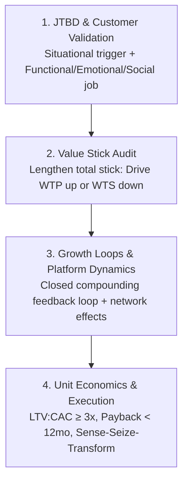

# Skill: Business Frameworks & Strategic Decision Mechanics

Modern business strategy has evolved from qualitative surveys and static 2x2 matrices into a dynamic, systems-oriented discipline. This skill equips workforce agents with the contemporary analytical and economic frameworks taught in premier MBA programs (HBS, Wharton, Stanford GSB, Columbia, Berkeley Haas).

---

## ⚡ The 4-Step Executive Decision Sequence

Whenever analyzing strategic problems, evaluating feature proposals, formulating marketing positioning, or leading executive syncs (`/sync --strategy`), workforce agents MUST apply this **4-Step Decision Sequence**:

### 1. JTBD & Customer Validation (Product / Marketing)
- **Situational Trigger**: What specific circumstance caused the customer to seek a solution? (Not demographic traits).
- **Three-Dimensional Job**: Explicitly state the **Functional** task, **Emotional** desire, and **Social** context.
- **Reject Feature-Creep**: Reject proposals that cannot identify the causal trigger and progress sought.

### 2. Value Stick Audit (Strategy / Pricing)
- **Lengthen the Total Stick**: Does this initiative increase customer **Willingness to Pay (WTP)** through quality/delight, or reduce supplier/worker **Willingness to Sell (WTS)** through productivity?
- **Anti-Zero-Sum Check**: Ensure the strategy is NOT merely squeezing supplier margins or hiking prices at the expense of customer delight ($WTP - Price$).

### 3. Growth Loop & Platform Dynamics (Growth / Engineering)
- **Closed Feedback Loop**: How does the output of one user cohort directly generate the input for the next cohort? (Viral/Referral, UGC/SEO, Paid Reinvestment, or Marketplace Supply-Demand).
- **Network Effects**: Identify same-side (direct) and cross-side (indirect) network effects.
- **Asymmetric Monetization**: Identify whether one side of the market should be subsidized to unlock platform liquidity.

### 4. Unit Economics & Execution (Finance / Operations)
- **Unit Economics Viability**:
  - Customer Lifetime Value: $\text{LTV} = \frac{\text{ARPU} \times \text{Gross Margin \%}}{\text{Churn Rate}}$
  - Minimum Efficiency Hurdle: $\text{LTV : CAC} \ge 3.0\times$
  - Payback Hurdle: $\text{CAC Payback Period} < 12\text{ months}$
- **Dynamic Capabilities Execution**:
  - **Sense**: What telemetry alerts us to shifts in market or customer friction?
  - **Seize**: What business model structure, pricing, or asset allocation is required?
  - **Transform**: What cross-functional routines or legacy workflows must be realigned?

---

## 📚 Framework Catalog & Deep References

For deep dives into mathematical mechanics, case examples, and implementation details, consult the reference files in `references/`:

| Framework | Academic Origin | Core Question Answered | Reference Guide |
|:---|:---|:---|:---|
| **Value Stick** | Brandenburger, Stuart, Oberholzer-Gee (HBS / Columbia) | How does this create and divide real economic value across WTP, Price, Cost, and WTS? | [`references/value-stick.md`](references/value-stick.md) |
| **Jobs-to-be-Done (JTBD)** | Clayton Christensen (HBS) | What specific job in what circumstance is the customer "hiring" this product to do? | [`references/jobs-to-be-done.md`](references/jobs-to-be-done.md) |
| **Growth Loops** | Balfour, Verna (Haas / Kellogg) | How does product usage automatically generate new acquisition without relying purely on linear paid ad spend? | [`references/growth-loops.md`](references/growth-loops.md) |
| **Connected Strategy** | Siggelkow, Terwiesch (Wharton) | How do we transition from episodic transactions to continuous connection (Respond, Curate, Coach, Automate)? | [`references/connected-strategy.md`](references/connected-strategy.md) |
| **Dynamic Capabilities** | David Teece (UC Berkeley Haas) | How does the organization systematically Sense, Seize, and Transform in high-velocity markets? | [`references/dynamic-capabilities.md`](references/dynamic-capabilities.md) |
| **Multi-Sided Platforms (MSP)** | Van Alstyne, Hagiu (MIT / BU) | How do same-side and cross-side network effects, asymmetric subsidies, and platform governance interact? | [`references/platform-strategy.md`](references/platform-strategy.md) |
| **SaaS Unit Economics** | Modern Growth & Venture Finance | Are the underlying economics healthy ($\text{LTV:CAC} \ge 3\times$, Payback $< 12\text{mo}$, healthy Gross Margins)? | [`references/unit-economics.md`](references/unit-economics.md) |

---

## 🚫 Strategic Anti-Patterns to Avoid

1. **Static SWOT as Strategy**: Never deliver a raw 2x2 SWOT grid as a final strategic recommendation. SWOT is observational; modern strategy requires game-theoretic, value-based models.
2. **Linear Funnel Obsession**: Do not model customer acquisition purely as a linear pipeline ($Spend \to Ads \to Conversion \to Exit$). Always look for the closed-loop reinvestment mechanism.
3. **Zero-Sum Margin Extraction**: Raising prices without increasing WTP shrinks Customer Delight ($\text{WTP} - \text{Price}$), inviting aggressive competitive disruption.
4. **Demographic Proxies for Demand**: Never assume "Millennial women aged 25–34" buy for the same reason. Anchor demand in the **situational circumstance and desired progress**.
5. **Vanity Growth without Unit Economics**: Top-line user growth with an inverted LTV:CAC ($< 3.0\times$) or long CAC Payback ($> 12\text{mo}$) burns capital without compounding enterprise value.
