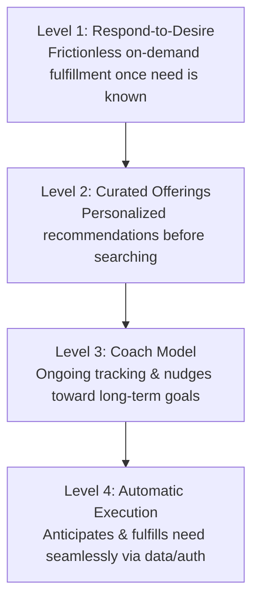

# Connected Strategy Framework

Traditional enterprise commerce is **episodic**: a firm waits for a consumer to experience a problem, search for options, negotiate a transaction, and leave until the next discrete event occurs.

The **Connected Strategy** framework replaces episodic friction with continuous, data-driven relationships that anticipate needs, curate options, and automate fulfillment.

---

## ⚡ The 4 Customer Connection Models

### 1. Respond-to-Desire
- **Mechanism**: The customer recognizes a need; the firm removes all friction from fulfillment.
- **Key Enablers**: 1-click checkout, instant digital delivery, live chat assistants, omni-channel inventory lookup.
- **Example**: Amazon 1-Click Ordering, Uber on-demand dispatch.

### 2. Curated Offerings
- **Mechanism**: The firm uses historical preference data and telemetry to recommend tailored choices before the customer begins an open-ended search.
- **Key Enablers**: Collaborative filtering, algorithmic personalization, curated subscription boxes.
- **Example**: Netflix recommendation feed, Spotify Discover Weekly, Stitch Fix styling.

### 3. Coach Model
- **Mechanism**: The firm tracks continuous user behavioral telemetry, diagnoses progress toward long-term goals, and delivers proactive nudges and reminders.
- **Key Enablers**: Wearables, smart sensors, automated telemetry webhooks, gamified milestones.
- **Example**: Apple Watch activity rings, Duolingo streak nudges, wealth management rebalancing advisors.

### 4. Automatic Execution
- **Mechanism**: The customer grants pre-authorization; algorithms anticipate replenishment or actions and execute transactions without requiring manual user intervention.
- **Key Enablers**: IoT device telemetry, predictive consumption models, pre-authorized smart contracts / billing tokens.
- **Example**: HP Instant Ink (printer auto-orders cartridges when low), continuous cloud auto-scaling, automated SaaS index backups.

---

## 🎯 Strategic Benefits

1. **Lower Acquisition & Servicing Costs**: Continuous connections turn single sales into high-retention annual streams.
2. **Proprietary Data Moats**: Every interaction loop enriches the predictive dataset, making recommendations harder for competitors to replicate.
3. **High Switching Costs**: Seamless automation creates deep customer habituation and workflow lock-in.
