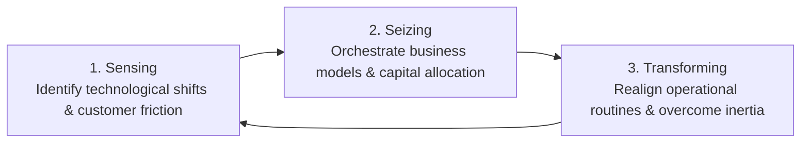

# Dynamic Capabilities Framework

Static competitive advantage (e.g. static patents, fixed plant assets, rigid resource-based VRIO views) quickly erodes in high-velocity, software-driven markets. **Dynamic Capabilities** define an organization's ability to integrate, build, and reconfigure internal and external competences to address rapidly changing environments.

---

## 🔄 The Sense-Seize-Transform Triad

### 1. Sensing (Scanning & Discovery)
- **Focus**: Systematic processes for scanning emerging tech (e.g. AI models, edge computing), monitoring competitor experiments, and uncovering latent customer friction.
- **Organizational Routines**: Customer discovery interviews, automated telemetry alerts, developer feedback loops, hackathons, scenario planning.

### 2. Seizing (Mobilizing & Business Model Design)
- **Focus**: Marshalling capital, securing talent, defining value propositions, designing platform architectures, and establishing pricing structures to capture sensed opportunities.
- **Organizational Routines**: Agile sprint resourcing, rapid prototyping, modular architecture design, partnership deal-making.

### 3. Transforming (Continuous Realignment)
- **Focus**: Continually renewing operational processes, organizational structures, and resource allocation to prevent cognitive inertia, bureaucracy, and legacy lock-in.
- **Organizational Routines**: Deprecating legacy code/products, reallocating headcount from declining business units to growth initiatives, shifting incentive systems.

---

## 🛠️ Dynamic Capabilities Checklist for Teams

When reviewing quarterly roadmaps or strategic pivots:
- [ ] **Sensing Check**: Are we detecting customer pain shifts before competitors do?
- [ ] **Seizing Check**: Is our business model and pricing ready to monetize the opportunity immediately?
- [ ] **Transforming Check**: Are legacy systems, outdated habits, or rigid org structures blocking cross-functional velocity?
