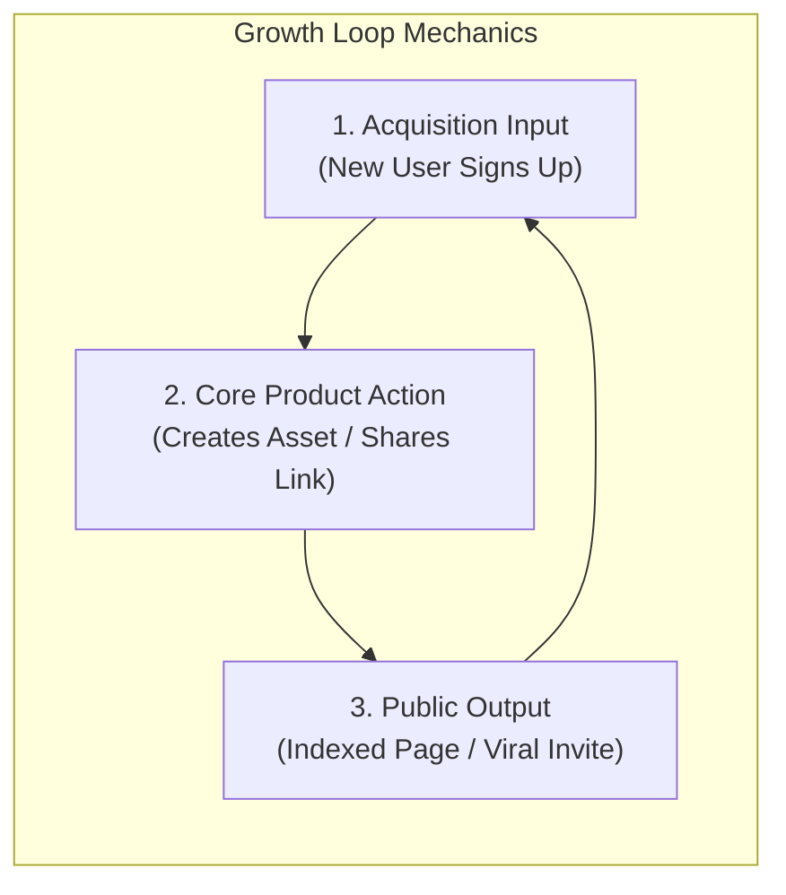

# Self-Reinforcing Growth Loops

Traditional marketing operates as a **linear funnel** (Awareness $\to$ Interest $\to$ Decision $\to$ Action). Linear funnels require constant top-of-funnel capital injection (ad spend) and suffer from severe friction and diminishing returns as customer acquisition costs (CAC) rise.

**Growth Loops** model acquisition as closed, self-sustaining systems where the output of a single user cycle directly feeds the input of the next cycle, producing compounding organic velocity.

---

## 🔄 The 4 Archetypal Growth Loops

### 1. Viral & Collaborative Loops
- **Mechanism**: Product usage is inherently multi-player or collaborative. Engaging with the product creates an artifact that must be sent to non-users.
- **Examples**: Slack/Teams channel invitations, Figma board sharing, DocuSign signature requests, Calendly booking links.
- **Formula**: $K\text{-factor} = i \times c$ (where $i$ = invitations per user, $c$ = conversion rate per invite). When $K > 1$, growth becomes exponential.

### 2. User-Generated Content (UGC) & Programmatic SEO Loops
- **Mechanism**: Users create public-facing content or profile data while solving their own problem. Search engines index this content, driving organic search visitors who convert and create more content.
- **Examples**: StackOverflow answers, Pinterest boards, Yelp/TripAdvisor reviews, GitHub public repositories, Zapier integration pages.

### 3. Paid Reinvestment Loops
- **Mechanism**: Revenue generated from converted users is systematically reinvested into predictable, high-intent paid acquisition channels with rapid payback periods ($< 6\text{ months}$).
- **Formula**: As long as $\text{Payback} < \text{Threshold}$ and $\text{LTV:CAC} \ge 3.0\times$, capital can be recycled multiple times within a single fiscal year.

### 4. Two-Sided Marketplace / Supply-Demand Loops
- **Mechanism**: Increased supply liquidity reduces customer wait times/prices, attracting more demand. Increased demand provides higher earnings/utilization for suppliers, attracting more supply.
- **Examples**: Uber (drivers $\leftrightarrow$ riders), Airbnb (hosts $\leftrightarrow$ guests), App Store (developers $\leftrightarrow$ smartphone users).

---

## 🛠️ Loop Audit Questions

- [ ] What is the step where a user's core workflow naturally exposes the product to non-users?
- [ ] How long does one full loop cycle take (Cycle Time)? Can we reduce loop cycle time from 14 days to 48 hours?
- [ ] Is our growth dependent entirely on paid top-of-funnel ad spend, or is at least one closed loop active?
