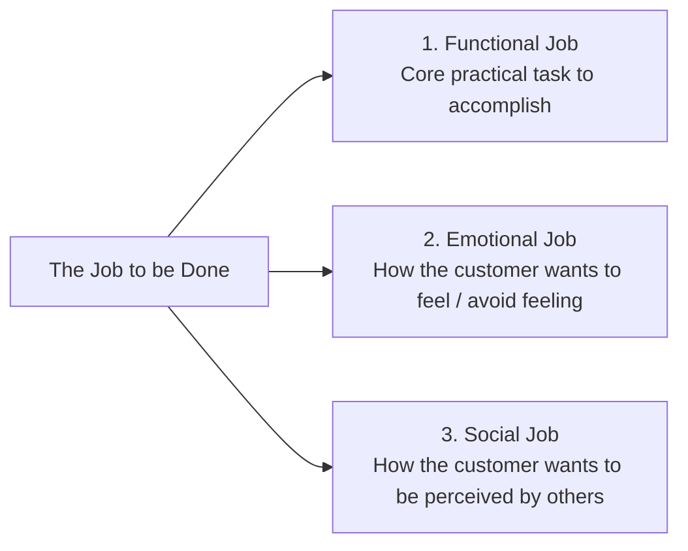

# Jobs-to-be-Done (JTBD) Theory

Pioneered by Clayton Christensen, **Jobs-to-be-Done (JTBD)** posits that customers do not buy products based on demographic attributes (e.g. "Male, 30–45, suburban homeowner"). Instead, customers encounter specific situations in their lives and **"hire"** a product or service to help them make progress.

> *"When people find themselves needing to get a job done, they essentially look around for a product or service they can 'hire' to help them do it."* — Clayton Christensen

---

## 🔍 The 3 Dimensions of a Job

Every Job-to-be-Done consists of three interconnected dimensions:

1. **Functional Dimension**: The practical, operational task the user needs solved (e.g. *extract data from PDF into spreadsheet in 5 seconds*).
2. **Emotional Dimension**: The internal state of mind sought or avoided (e.g. *feel confident that numbers are audit-proof; eliminate Sunday-night anxiety*).
3. **Social Dimension**: The interpersonal perception and status dynamics (e.g. *be viewed by executive leadership as organized, data-driven, and forward-thinking*).

---

## 🥛 The Classic Case: The Commuter Milkshake

A fast-food chain attempted to improve milkshake sales using traditional demographic focus groups, asking customers: *"How can we make our milkshakes better? Thicker? Sweeter? More chocolate?"* Sales remained flat.

Applying JTBD revealed:
- **Circumstance**: Over 40% of milkshakes were purchased before 8:30 AM by solo commuters facing a long, boring drive.
- **The Job**: Make a monotonous 45-minute commute engaging while providing a tidy, slow-sipping fuel source that holds hunger off until lunch.
- **True Competitors**: Not rival milkshakes, but **bananas** (eaten too quickly), **donuts** (crumbly, messy hands), and **bagels** (dry, difficult to chew while steering).
- **The Solution**: Make the milkshake thicker so it lasted the whole drive, add tiny fruit chunks for sporadic engagement, and position a fast-dispense card reader by the front entrance.

---

## 📝 JTBD Statement Syntax

When defining customer problems in `/advisor`, `/feature`, or marketing copy:

$$\text{When } [\text{Situational Trigger / Context}], \text{ I want to } [\text{Action / Desired Progress}], \text{ so I can } [\text{Expected Outcome / Emotional Benefit}].$$

### Example:
- *Weak / Demographic*: "Our target is enterprise developers who want faster builds."
- *JTBD Formulation*: "When a CI/CD build fails 10 minutes before a staging release, I want immediate root-cause symbol diffs without digging through 5,000 lines of console logs, so I can deploy confidently without delaying the team sprint."
