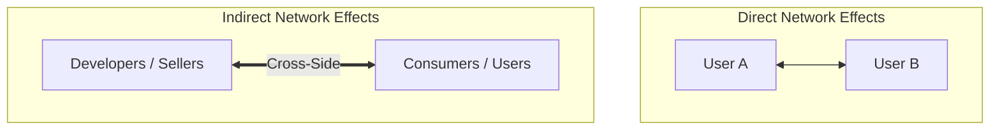

# Multi-Sided Platform (MSP) Strategy

Traditional businesses are **pipelines**: they purchase raw materials from upstream suppliers, transform them into finished products, and push them down to consumers along a linear value chain.

**Multi-Sided Platforms (MSPs)** create value primarily by enabling direct interactions and transactions between two or more distinct, affiliated user groups (e.g. buyers and sellers, developers and users, riders and drivers).

---

## 🌐 Network Effects Architecture

### 1. Same-Side (Direct) Network Effects
- **Definition**: The value of a platform for a user on side $A$ increases as more users join side $A$.
- **Positive Example**: Telephony/messaging (more friends on WhatsApp $\to$ higher utility).
- **Negative Example**: Crowding/congestion (too many drivers competing for the same ride).

### 2. Cross-Side (Indirect) Network Effects
- **Definition**: The value of a platform for a user on side $A$ increases as participation on side $B$ expands.
- **Positive Example**: Video gaming consoles (more gamers attract more game studios; more exclusive titles attract more gamers).

---

## 💰 Asymmetric Pricing Models

Platform economics rarely apply symmetric margins to all sides. Instead, operators structure pricing to solve the "chicken-and-egg" launch problem:

- **The Subsidized Side**: The side that is more price-sensitive or generates stronger cross-side network effects. Often receives free access, promotional discounts, or software developer kits (SDKs) below cost (e.g., consumers on Google Search, readers on news portals).
- **The Money Side**: The side that captures high commercial value from accessing the subsidized side and is willing to pay premium transaction fees or advertising rates (e.g., advertisers on Google Search, merchants on credit card networks).

---

## 🛡️ Platform Governance & Openness

1. **Openness vs Quality Filter**: Open APIs accelerate developer adoption, while curated App Store review processes protect user safety and brand trust.
2. **Platform Envelopment**: Integrating complementary software features into the core platform layer (e.g., Apple adding screen-time tracking or spotlight search) to defend ecosystem boundaries.
