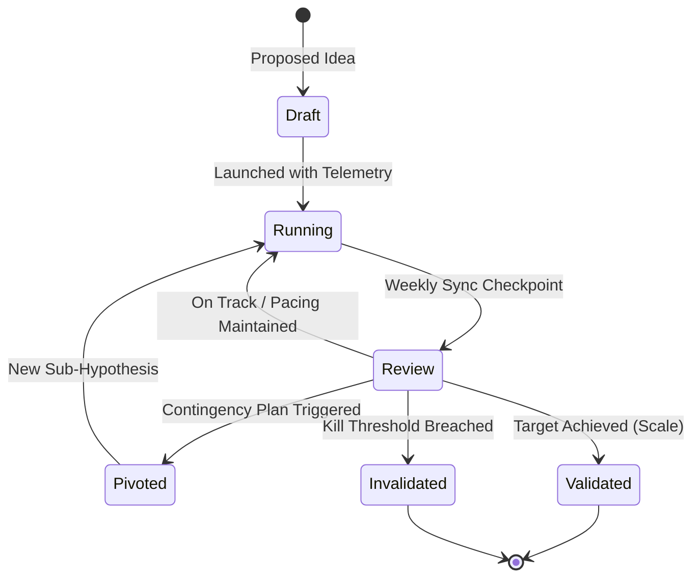

# Hypothesis Tracker

A structured, scientific experimentation framework for workforce teams. Turns growth bets, marketing campaigns, sales tactics, and product features into measurable, falsifiable hypotheses linked to company goals.

---

## When to Use

- Planning a new sales outreach strategy or outbound campaign (e.g. `@sales`)
- Testing a new acquisition channel, SEO programmatic cluster, or ad strategy (e.g. `@growth`, `@marketer`)
- Scoping a speculative product feature or onboarding flow redesign (e.g. `@advisor`, `@designer`, `@programmer`)
- Running weekly strategic reviews via `/sync --strategy` to audit progress, kill failing experiments, and double down on validated winners.

---

## Scientific Hypothesis Formula

Every experiment managed by the `hypothesis-tracker` follows the **Falsifiable Value Formula**:

> *"We believe that **[Doing Action X]** for **[Target Audience Y]** will achieve **[Quantified Outcome Z]** within **[Timeframe T]**, measured by **[Telemetry Metric K]**.*  
> *If **[Kill Threshold Breach]**, we will **[Contingency / Pivot Action]**."*

---

## Experimental Lifecycle



| State | Folder | Meaning |
|:---|:---|:---|
| `draft` | `workforces/hypotheses/draft/` | Hypothesis proposed but not yet funded or launched |
| `running` | `workforces/hypotheses/running/` | Active experiment in market with active telemetry |
| `validated` | `workforces/hypotheses/validated/` | Target metrics achieved; proven playbook ready for scale |
| `invalidated` | `workforces/hypotheses/invalidated/` | Target missed or kill threshold breached; stopped to prevent resource waste |
| `pivoted` | `workforces/hypotheses/pivoted/` | Initial approach adapted into an adjusted strategy based on market feedback |

---

## Leading vs. Lagging Telemetry

Hypotheses MUST distinguish between two metric types:

1. **Leading Indicators (Predictive & Actionable):**
   - Direct signals of effort and immediate customer engagement (e.g. *Cold emails sent*, *Reply rate %*, *Search impressions*, *Interactive demo starts*).
   - Show progress in days rather than months.
2. **Lagging Indicators (Ultimate Business Impact):**
   - Final commercial outcomes (e.g. *Closed ARR*, *Paid customers acquired*, *30-day retention %*).

---

## CLI Usage

### 1. Create a Hypothesis
```bash
python3 .agents/skills/hypothesis-tracker/scripts/hypothesis.py \
    --create \
    --title "Personalized Loom Video Outbound for Series A CTOs" \
    --owner sales \
    --supporting-teams marketing growth \
    --goal-id "Q1-KR2" \
    --goal-title "Acquire 25 pilot enterprise customers" \
    --statement "We believe that sending personalized 30s Loom audits to Series A CTOs will achieve a 12% reply rate and 8 demo bookings within 3 weeks." \
    --timeframe-weeks 3 \
    --kill-threshold "Reply rate < 3% after 100 sends" \
    --pivot-plan "Kill video audits and switch to concise plain-text problem cadences" \
    --metrics '[{"name":"Sends","type":"leading","baseline":0,"target":100,"current":0,"unit":"count"},{"name":"Reply Rate","type":"leading","baseline":1.5,"target":12.0,"current":1.5,"unit":"%"},{"name":"Demo Bookings","type":"lagging","baseline":0,"target":8,"current":0,"unit":"count"}]' \
    --session-id "024" \
    --session-file "workforces/session-context/024_2026-08-23_topic.md" \
    --sync-session
```
*(Fallback: `python3 skills/hypothesis-tracker/scripts/hypothesis.py ...`)*

### 2. Update Progress & Telemetry (Weekly Check-In)
```bash
python3 .agents/skills/hypothesis-tracker/scripts/hypothesis.py \
    --update "HYP-20260823-01" \
    --current-week 2 \
    --metrics-data "Sends=65,Reply Rate=8.2,Demo Bookings=4" \
    --insight "CTOs who responded noted they skipped video and read first 2 lines. Shortening text for batch 3." \
    --sync-session
```

### 3. List & Filter Active Experiments
```bash
python3 .agents/skills/hypothesis-tracker/scripts/hypothesis.py --list --status running
```

### 4. Generate Strategic Sync Review Block
```bash
python3 .agents/skills/hypothesis-tracker/scripts/hypothesis.py --review
```

### 5. Enforce Kill Criteria (Stop Zombie Projects)
```bash
python3 .agents/skills/hypothesis-tracker/scripts/hypothesis.py \
    --kill "HYP-20260823-01" \
    --rationale "Reply rate plateaued at 2.1% after 120 sends. Kill threshold reached." \
    --sync-session
```

### 6. Pivot Strategy
```bash
python3 .agents/skills/hypothesis-tracker/scripts/hypothesis.py \
    --pivot "HYP-20260823-01" \
    --rationale "Pivoted from video audits to interactive ROI calculator widget based on prospect feedback." \
    --sync-session
```

### 7. Validate & Scale
```bash
python3 .agents/skills/hypothesis-tracker/scripts/hypothesis.py \
    --validate "HYP-20260823-01" \
    --rationale "Target exceeded: 14% reply rate and 10 bookings in 3 weeks. Scaling budget." \
    --sync-session
```

---

## Integration with `/sync --strategy`

During strategic reviews, `@advisor` uses this skill to:
1. Review all `running` experiments against their target deadlines.
2. Flag experiments marked as `💀 Target Missed (Kill / Pivot)`.
3. Challenge the team on whether failed hypotheses are being killed promptly or lingering as resource drains.
4. Extract lessons learned into `workforces/knowledge-catalog/` and origin session notes.
