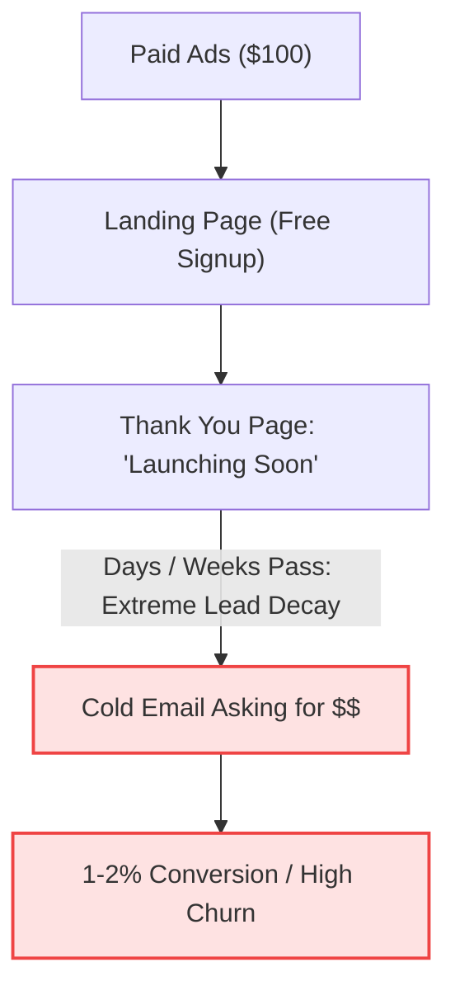

# Skill: App Launch & Fast Validation Playbook

A high-velocity operational playbook designed for empty projects, pre-revenue apps, or stalled initiatives. Relentlessly optimizes for two core velocity metrics: Time to First Dollar and Time to 100 Users.

---

## Triggering & Execution

This playbook is led by `@launcher` and invoked via targeted prompts:

### Prompt Triggers
- *"Launch validation playbook"* (run full launch & validation pipeline)
- *"Plan 7-day sprint to first dollar (TTFD)"* (focus on rapid early-adopter offer & pre-sale)
- *"Scale distribution to 100 users (TTOU)"* (unroll 100-user acquisition playbook)
- *"Audit launch friction & waitlist decay"* (diagnose conversion bottlenecks)
- *"Set up pre-sale painted door rails"* (Stripe links, manual concierge flow, copy)

---

## 1. Executive Concepts & Core Velocity Metrics

```mermaid
graph LR
    A["Idea Inception"] -->|TTFD Sprint (Days 1-7)| B["First Paid Dollar ($)"]
    B -->|TTOU Scale (Weeks 2-6)| C["100 Active Retained Users"]
    style B fill:#dcfce7,stroke:#16a34a,stroke-width:2px
    style C fill:#dbeafe,stroke:#2563eb,stroke-width:2px
```

### ⚬ TTFD (Time to First Dollar)
The elapsed calendar time between formulating an app idea and securing your first financial transaction.
- **Why it matters:** Compliments, free signups, and email waitlists measure passive curiosity. TTFD measures true **purchase intent** and willingness to pay.
- **Rule of Thumb:** If TTFD exceeds 14 days, the validation sprint is stalled. Strip all engineering down to a concierge MVP or pre-sale painted door.

### ⚬ TTOU (Time to One Hundred Users)
The speed at which you reach 100 active, paying, or retained users.
- **Why it matters:** 100 users is the statistical inflection point where retention curves stabilize, referral loops can be measured, and distribution channel viability is proven.
- **Rule of Thumb:** Do not invest in scalable infrastructure or automated multi-tier billing until TTOU is achieved.

---

## 2. Funnel Audit: Free Waitlist vs. High-Velocity Pre-Sale

### The Proposed Funnel (Standard Waitlist Trap)



### Key Bottlenecks in the Standard Waitlist

| Step | Hidden Friction Point | The High-Velocity Fix |
| :--- | :--- | :--- |
| **$100 Ad Budget** | At $1.50–$3.00 CPC, $100 generates 30–60 clicks. At a 10% conversion rate, that yields 3–6 free emails (statistically insignificant sample size). | Use manual outreach to validate messaging first, or route ads directly to a low-ticket pre-order to recoup ad spend immediately (**ROAS self-funding**). |
| **"Launching Soon" Page** | Free email leads decay rapidly. By day 7, open rates drop below 20%, and conversion to paid drops to 1–2%. | Introduce an **immediate cash offer** or card capture on the confirmation page while excitement is peak. |
| **Three Tier Pricing ($10 / $99 / $500)** | Offering subscriptions and high-ticket lifetime deals simultaneously introduces decision paralysis for unreleased software. | Simplify to a **single irresistible early-adopter offer**: e.g., a heavily discounted Lifetime Deal (LTD) capped at the first 25–50 users. |

---

## 3. High-Velocity Validation Frameworks

### Framework A: The Pre-Sale "Painted Door"
Instead of collecting free emails, test true purchasing intent before writing a single line of backend code.

1. **Direct Purchase Link:** Add a clear call-to-action (CTA) like:
   `"Join the Founding Cohort — $29 (One-Time)"`
2. **Stripe Checkout / Pre-Auth Rails:**
   - **Option 1 (Direct Payment):** Collect payment upfront via Stripe Payment Links. Set clear expectations:
     > *"Beta access unlocks on [Target Date]. 100% money-back guarantee if you're unsatisfied."*
   - **Option 2 (Stripe SetupIntent / Card Hold):** Collect and save credit card details without capturing funds immediately. Charge the card only when product access is delivered.
   - **Option 3 (Honest Painted Door):** If users click checkout, route them to an honest capacity modal:
     > *"We've temporarily capped this beta cohort to ensure 1-on-1 support. Enter your email below to reserve your 50% discount priority when the next slot opens."*

### Framework B: The Concierge MVP (Wizard of Oz)
Deliver the core outcome manually before automating it with code.
- **Content / Hook Generators:** Generate hooks manually with custom LLM prompts and send them via email within 2 hours.
- **Data Scraping / Intelligence:** Scrape competitor pricing manually into a spreadsheet and deliver an executive PDF report.
- **Auditing Tools:** Run manual audits using open-source CLI tools or spreadsheets and deliver personalized recommendations.
- **Core Benefit:** You generate immediate revenue and receive rich, qualitative product feedback on day one without software bugs.

---

## 4. The 7-Day Sprint to First Dollar (TTFD)

```
Day 1: Positioning & Landing Page
  ├── Define target customer + specific pain point
  └── Set up 1-page landing page (Carrd, Framer, or simple HTML)

Day 2: Payment Rails & Offer Setup
  ├── Create Stripe account & configure Stripe Payment Links
  └── Define single offer (e.g., $49 Founder Lifetime Access)

Day 3–4: Manual Outreach (Zero Ad Spend)
  ├── Identify 50 people complaining about the problem on X, Reddit, or LinkedIn
  └── Send personalized outreach messages to secure first 1–3 pre-sales

Day 5: Micro Ad Test ($50–$100)
  ├── Run hyper-targeted ads (Reddit subreddits or Meta niche interest)
  └── Measure Cost-per-Click (CPC) and checkout initiation rate

Day 6–7: Manual Delivery & Feedback Loop
  ├── Fulfill the outcome manually or deploy minimum working prototype
  └── Conduct 15-minute onboarding calls with every paying customer
```

---

## 5. Tactical Templates & Copy

### A. Landing Page Hero Structure
- **Headline:** Focus on the outcome, not the tool.
  - **Formula:** `Achieve [Desirable Outcome] without [Major Pain Point] in [Timeframe].`
  - **Example:** *"Audit your website for SEO issues in 60 seconds without complex enterprise software."*
- **Subheadline:** Explain how it works in plain, jargon-free language.
- **Primary CTA:** `Reserve Founder Access — $49 (Normally $199)`
- **Risk Reversal:** `30-day no-questions-asked refund guarantee.`

### B. Thank-You Page Upsell Copy
If you collect emails on step 1, upsell immediately on step 2:

> **You're on the list! But wait...**
> 
> We are onboarding our private beta in cohorts of 25 users.
> 
> Want to skip the queue and lock in Lifetime Access for **$49** (regularly $15/month)?
> 
> **[Claim Founder Pass — Instant Access Next Week]**  
> *(Offer limited to the first 25 signups)*

### C. Direct Outreach DM Script (Social / Communities)
Send this to users asking questions or venting about the specific problem you solve:

> *"Hey [Name], saw your post about [pain point]. I'm actually wrapping up a small tool that [solves specific pain point in X way].*
> 
> *I'm letting 10 early testers in this Friday at a heavily discounted rate in exchange for honest feedback. If you're interested, happy to share the link or show you how it works—no pressure either way!"*

---

## 6. Scaling to 100 Users (TTOU)

Once TTFD is proven and paying customers validate the core value prop, scale distribution to reach 100 active users:

1. **Directory Launches:** Post structured launches to:
   - Product Hunt
   - Betalist
   - MicroLaunch
   - 1000Tools
   - Relevant subreddits (`r/SideProject`, `r/IndieHackers`, `r/SaaS`)
2. **Founder-Led Content (Build in Public):**
   - Share transparent metrics, screenshots of customer feedback, and lessons learned on X and LinkedIn.
   - Post before-and-after case studies from Day 6–7 concierge customers.
3. **Incentivized Referrals:**
   - Give paying users 1 free month or a 20% recurring commission (via Rewardful or Tolt) for every colleague they refer.
4. **Programmatic / Cold Outreach:**
   - Scrape laser-targeted leads using tools like Apollo or Clay.
   - Run personalized cold email sequences offering a free mini-audit or concierge onboarding.
