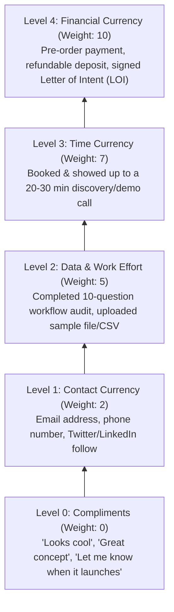

# Skill: Rapid Market Validation & Revenue Pretotyping

A structured, low-budget, high-velocity market validation system for founders, product managers, and workforce agents. Turns speculative business ideas into revenue-tested hypotheses before building full software products.

---

## ⚡ Core Philosophy & Foundational Rules

1. **"Make sure you are building the right *it* before you build it right."** — *Alberto Savoia*  
   Zero lines of production code should be written for an unvalidated idea. First validate demand through **pretotyping** (pretend prototypes).
2. **"Currency over Compliments."**  
   Polite praise ("That's a great idea! I would definitely use that!") is noise and false positive data. True validation requires **Skin in the Game** (money, time, data, or reputation).
3. **"Past Behavior over Hypothetical Intent."** — *The Mom Test (Rob Fitzpatrick)*  
   Never ask customers what they *would* do in the future. Ask what they *already do*, what workarounds they *currently use*, and how much money/time they *already spend*.
4. **"Kill Early to Scale Winners."**  
   Every validation sprint must have a pre-committed **Kill Threshold**. Failing ideas are terminated within 7 days to preserve budget and focus.

---

## 🪜 The "Skin in the Game" Commitment Hierarchy

When evaluating market demand signals, score customer responses strictly according to the **Commitment Currency Ladder**:



| Level | Currency Type | Value Weight | Interpretation & Action |
| :---: | :--- | :---: | :--- |
| **0** | **Compliments** | **0 / 10** | ⚠️ **Danger / False Signal:** Polite praise from friends or casual commenters. Disregard completely. |
| **1** | **Contact Info** | **2 / 10** | **Low Commitment:** Basic interest. Valid only when combined with high conversion volume ($> 10\%$). |
| **2** | **Work Effort / Data** | **5 / 10** | **Moderate Commitment:** Prospect invested cognitive energy to give specific workflow data. |
| **3** | **Time Investment** | **7 / 10** | **High Commitment:** Prospect gave up 20–30 minutes of personal calendar time to discuss their pain. |
| **4** | **Financial Commitment** | **10 / 10** | 🏆 **Gold Standard:** Cash pre-order, deposit, or enterprise LOI. Proves real willingness to pay. |

---

## 🎯 The 4 Low-Cost Rapid Validation Playbooks

Choose the validation channel matching the product type and target buyer:

### Playbook 1: The Smoke Test Landing Page + Micro-Ads (B2C & Self-Serve SaaS)
- **Timeframe:** 2–4 days
- **Budget:** \$50 – \$100 ad spend
- **Execution:**
  1. Build a high-converting one-page site (Carrd, Framer, or Next.js) highlighting the acute problem, 3 core benefits, and clear pricing tiers.
  2. Add a **"Fake Door" CTA**: *"Pre-Order with 50% Early Bird (\$29)"* or *"Start Free Trial"*.
  3. Clicking opens an intent modal: *"We are onboarding early beta cohorts in batches. Enter your work email and role to get priority access."* (Optional: Take a \$10 refundable deposit).
  4. Run targeted Google Search Ads (on high-intent keywords like *"how to automate [X]"*) or Meta/Reddit Ads.
- **Success Benchmark:** Click-to-signup conversion rate $> 8–12\%$; Cost per qualified lead $<\$3.00$.

---

### Playbook 2: Direct Cold Outreach & "The Mom Test" (B2B & High-Ticket SaaS)
- **Timeframe:** 2–3 days
- **Budget:** \$0
- **Execution:**
  1. Identify 50 targeted decision-makers on LinkedIn or via cold email.
  2. Send a non-sales problem exploration message (never pitch the product in message 1):
     > *"Hey [Name], I noticed you lead [Department] at [Company]. I'm researching how teams handle [Specific Pain Point]. How do you currently solve this, and is it a top-3 headache for your team this quarter?"*
  3. Conduct 15-minute discovery calls focusing on past behaviors, budget, and workarounds.
  4. At the end of the call, propose a pilot: *"We're building an automated solution for this. If I have a working prototype in 2 weeks, would you be open to a 30-day pilot for \$X?"*
- **Success Benchmark:** $> 15–20\%$ response rate; $\ge 5$ discovery calls booked; $\ge 2$ LOIs or pilot commitments.

---

### Playbook 3: Community Infiltration (Niche Communities & Vertical SaaS)
- **Timeframe:** 1–2 days
- **Budget:** \$0
- **Execution:**
  1. Find where target buyers congregate (Subreddits, Discord servers, Slack communities, Facebook Groups).
  2. Post a **Value-First Problem Breakdown** (no promotional links):
     > *"I spent 20 hours analyzing why [Common Process] takes forever in [Industry]. Here are the 3 major bottlenecks and the spreadsheet formulas I used to fix them."*
  3. Add a soft call to action in the comments or bio: *"I'm automating this entire workflow into a lightweight tool. Drop a comment or DM if you want early beta access."*
- **Success Benchmark:** $> 15$ engaged comments or inbound DMs asking for access.

---

### Playbook 4: Build in Public / Audience First (DevTools & Creator Economy)
- **Timeframe:** Ongoing (3–5 days for initial test)
- **Budget:** \$0
- **Execution:**
  1. Share the raw design mockup or interactive prototype on X, LinkedIn, or YouTube.
  2. Frame as an architectural or product choice: *"I'm building a tool that solves [Pain]. Option A uses [Approach 1], Option B uses [Approach 2]. Which one solves your daily friction better?"*
  3. Link to a priority waitlist with an instant access incentive.
- **Success Benchmark:** Viral engagement ratio ($> 5\%$ repost/reply rate) and organic waitlist signups.

---

## 📝 Standard Validation Templates

### 1. The Falsifiable XYZ Hypothesis Template
```markdown
### 🔬 Falsifiable Validation Hypothesis
- **Hypothesis Code:** HYP-[YYYYMMDD]-[SEQ]
- **Owner:** [@agent or team]
- **Target Persona:** [Specific role, industry, and situational trigger]
- **XYZ Formula:** "We believe that at least **[X]%** of **[Target Audience Y]** will perform **[Skin-in-the-Game Action Z]** when presented with **[Offer / Value Prop]** within **[Timeframe]**."
- **Leading Indicator:** [e.g. Ad clicks, Page visitors, Cold outreach sends, Inbound DMs]
- **Lagging Indicator:** [e.g. Email signups, Pre-orders ($), Calls booked, LOIs signed]
- **Target Hurdle:** [e.g. >= 10% conversion rate or >= 5 booked calls]
- **Kill Threshold:** [e.g. Conversion < 3% after 200 visitors or 0 calls booked from 50 outreaches]
- **Pivot Contingency:** [What specific angle/offer to test next if primary hypothesis misses]
```

---

### 2. Smoke Test Landing Page Copy Blueprint
```markdown
# 📄 Smoke Test Landing Page Copy Spec

## 1. Header & Hero Section
- **Badge:** "Private Beta Launching [Month Year]"
- **Main Headline (H1):** [Outcome-driven hook: "Eliminate [Major Pain] in [Timeframe] without [Tedious Workaround]"]
- **Sub-headline (H2):** [1-2 sentences clarifying the mechanism: "The lightweight automated tool for [Persona] that turns [Input] into [Output] in 60 seconds."]
- **Primary CTA Button:** "Pre-Order Beta Access ($29)" / "Join Priority Waitlist"
- **Risk Reversal Micro-copy:** "100% money-back guarantee • No credit card required for waitlist"

## 2. The 3 Core Transformation Points
- **Point 1:** [Pain Eliminated] — "Stop spending 6 hours/week on manual data entry."
- **Point 2:** [Speed / Advantage] — "Generate compliant reports in 1 click."
- **Point 3:** [Outcome / ROI] — "Increase client retention by delivering 3x faster."

## 3. "Fake Door" Intent Modal (Upon Clicking CTA)
- **Modal Title:** "You're Early! 🎉"
- **Modal Copy:** "We are currently onboarding our first cohort of 50 founding members. Enter your email and role below to lock in lifetime 50% pricing and priority access."
- **Input Fields:**
  1. Work Email (Required)
  2. Current Job Title / Company Size (Required)
  3. "What is your #1 biggest frustration with [Current Tool]?" (Optional)
- **Submit Button:** "Reserve My Spot →"
```

---

### 3. "The Mom Test" Cold Outreach Script
```markdown
# 💬 The Mom Test Cold Outreach Script

**Subject:** Quick question about [Process/Pain Point]

Hi [First Name],

Saw that you lead [Department/Function] at [Company] — hope your quarter is off to a great start.

I'm doing research on how [Role / Industry] teams are handling [Specific Friction Point, e.g., manual compliance logging for client audits]. 

Not trying to sell you anything — just curious:
1. How does your team currently handle [Friction Point] today?
2. Is that something that actively eats up time, or is it already solved by your current stack?

Would love to hear your thoughts if you have 60 seconds.

Best,
[Your Name]
```

---

### 4. PM Gatekeeper Validation Scorecard
```markdown
# 📊 PM Market Validation Scorecard

| Metric Category | Target Hurdle | Actual Result | Status |
| :--- | :--- | :--- | :---: |
| **Traffic / Reach** | 200 visitors / 50 sends | [Actual] | 🟢 / 🔴 |
| **Cost Incurred** | $\le \$100$ | $[Actual Spend] | 🟢 / 🔴 |
| **Skin-in-the-Game Level** | Level 3 (Calls) or Level 4 (Cash) | Level [0-4] | 🟢 / 🔴 |
| **Primary Conversion Rate** | $\ge [Target]\%$ | $[Actual]\%$ | 🟢 / 🔴 |
| **Cost Per Validated Lead** | $\le \$[Target]$ | $\$[Actual]$ | 🟢 / 🔴 |

### Gatekeeper Verdict:
- 🟢 **VALIDATE & SCALE (Build MVP):** Target metrics achieved; proven willingness to pay. Hand off to `/site-setup` and `/work`.
- 🔄 **PIVOT OFFER:** Strong engagement but low commitment currency. Adjust positioning, pricing tier, or target persona and re-test for 72h.
- 💀 **KILL EXPERIMENT:** Kill threshold breached. Sunset idea immediately and log findings in `workforces/hypotheses/invalidated/`.
```

---

## 🛠️ CLI & Subagent Integration

- **Register New Experiment:** Use `hypothesis.py --create` from `skills/hypothesis-tracker/` to register the validation bet.
- **Log Daily Telemetry:** Use `hypothesis.py --update` to record impressions, visitors, emails, calls, and pre-orders.
- **Triage via Sync:** Use `/sync --strategy` with `@advisor` and `@project-manager` to review open validation bets weekly.
