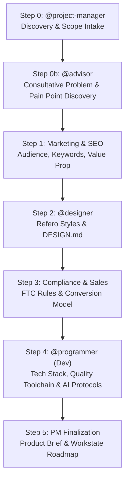

# 🚀 Site Setup & Product Brief Architecture

The definitive protocol for taking an empty repository or folder from a raw idea to a fully configured, branded, compliant, and scaffolded web property.

Triggered after ideation handoffs (`/wf-ideate`, `/wf-advisor`), or via natural prompts (*"Set up new site"*, *"Create product brief and scaffold app"*).

---

## 👥 Multi-Team Handoff Architecture

Site setup is not a monolithic step; it is an orchestrated pipeline managed by the `@project-manager` and handed off to specialized team roles:

### Team Responsibilities & Artifacts
| Stage | Owner / Team | Focus | Output Artifacts |
| :--- | :--- | :--- | :--- |
| **0. Strategy & Scope** | `@project-manager` | Site category, business model, team registration | `workforces/workstate.md`, `workforces/teams/` |
| **0b. Consultative Discovery** | `@advisor` | 5-Dimension problem extraction: root cause, acute pain points, failed workarounds, cost of inaction, problem-to-solution matrix | `docs/product-brief.md` (Problem & Pain Points), [`consultant-discovery-framework.md`](templates/consultant-discovery-framework.md) |
| **1. Marketing & SEO** | `marketing` / `@marketer` | Target audience, pain points, keyword strategy, copy hook | `docs/brand-context.md` (Voice, Audience, SEO) |
| **2. Visual Design & DESIGN.md** | `design` / `@designer` | Refero Styles ([styles.refero.design](https://styles.refero.design/)), typography pairings, color tokens, layout blueprints, icon pack | `DESIGN.md`, `src/styles/tokens.css`, `docs/brand-context.md` |
| **3. Compliance & Sales** | `compliance` (`@compliance`) / `sales` (`@sales`) | Affiliate disclosures (Lead Gen) vs Direct SaaS terms, conversion CTAs | Compliance clauses in `docs/product-brief.md` |
| **4. Scaffolding, Quality Toolchains & Protocols** | `dev` / `@programmer` | Scaffolding tech stack, configuring complete quality toolchain (unit testing, static analysis, linters, architecture guards, mutation testing, automated upgrades, security audits), language-specific AI protocol files (`robots.txt`, `llms.txt`, `ai.txt`, `sitemap`) | Codebase scaffolding, quality configs, CI workflows, protocol files |
| **5. Brief Finalization** | `@project-manager` | Consolidate 7 mandatory brief sections + Problem-to-Solution Matrix, unblock P0 build tasks | `docs/product-brief.md`, `workforces/workstate.md` |

---

## 🛑 Framework Scaffolding & Install Safeguard Rule

Whenever executing framework initialization or package installation commands:
- **No Manual Boilerplate Coding**: If an automated command (such as `npx create-next-app`, `npm create vite@latest`, `django-admin startproject`, `poetry new`, `firebase init`, `amplify init`, `docker build`) fails, stalls, requires interactive input, or hits sandbox network isolation:
  1. **DO NOT attempt to manually code framework internals, config boilerplate, or package directories by hand.**
  2. **STOP execution immediately.**
  3. Output the exact command for the user to run in their host terminal.
  4. Wait for the user to confirm completion before proceeding.

---

## 🛠️ Technology Stack & Hosting Matrix

| Technology | Preferred Scaffolding Command | AI Protocol Strategy |
| :--- | :--- | :--- |
| **Next.js (App Router)** | `npx -y create-next-app@latest ./ --typescript --tailwind --eslint --app --src-dir` | `src/app/sitemap.ts` (static export `force-static`), `public/robots.txt`, `public/llms.txt`, `public/ai.txt`, `public/.well-known/ai-plugin.json` |
| **Vite / React / Vue** | `npm create vite@latest ./ -- --template react-ts` | `public/robots.txt`, `public/llms.txt`, `public/ai.txt`, `public/sitemap.xml` |
| **Astro** | `npm create astro@latest ./ -- --template minimal --no-install --no-git` | `@astrojs/sitemap`, `public/robots.txt`, `public/llms.txt`, `public/ai.txt` |
| **Python (FastAPI)** | `poetry new ./` or `pip install fastapi uvicorn` | `/static/robots.txt`, `/static/llms.txt`, `/static/ai.txt`, dynamic `/sitemap.xml` route |
| **Python (Django)** | `django-admin startproject config .` | `django.contrib.sitemaps`, static `robots.txt`, `llms.txt` |
| **Cloudflare Pages** | Integrated with Next.js/Vite/Astro build output (`out` or `dist`) | Native fast-edge static file serving with custom header rules |
| **AWS Amplify** | `npx -y @aws-amplify/cli init` / `amplify.yml` | Custom rewrites in `amplify.yml` for text/markdown MIME types |
| **Google Firebase / Cloud Run** | `firebase init hosting` / `firebase.json` | Hosting rewrites in `firebase.json` for static AI protocol files |
| **Docker** | Containerized multi-stage `Dockerfile` + `docker-compose.yml` | Nginx / Caddy static layer or app server serving protocols |

---

## 🛡️ Quality Engineering & Toolchain Setup (Step 3b)

Scaffolding must not stop at bare framework files. Step 3b establishes the engineering quality harness:

### 1. Verification Scripts Matrix
Ensure the project configuration (`package.json`, `pyproject.toml`, or `composer.json`) provides the standard quality commands:
- `test`: Executes unit test runner (`vitest run`, `jest`, `pytest`, `pest`).
- `typecheck` (or `check`): Executes strict static analysis (`tsc --noEmit`, `mypy --strict`, `phpstan analyse`).
- `lint`: Executes code formatter and linter (`biome check .`, `eslint .`, `ruff check .`).
- `audit`: Executes dependency security vulnerability scanner (`npm audit`, `pip-audit`, `composer audit`).
- `test:mutation`: Executes mutation testing on core logic (`stryker run`, `mutmut run`).

### 2. Architecture & Dependency Boundary Guards
- Scaffold [`.dependency-cruiser.js`](templates/quality-toolchain/dependency-cruiser.js) (or `madge`) to forbid circular imports and prohibit presentation layers (UI) from directly querying database/ORM layers.

### 3. Mutation Testing Harness
- Scaffold [`stryker.config.json`](templates/quality-toolchain/stryker.config.json) (or `mutmut`) targeting core business logic, validation services, and calculations to ensure tests kill mutants rather than just providing shallow line coverage.

### 4. Automated Upgrades & Continuous Quality CI
- Scaffold [`.github/dependabot.yml`](templates/quality-toolchain/dependabot.yml) with grouped semantic PR rules for minor/patch dependencies.
- Scaffold [`.github/workflows/quality.yml`](templates/quality-toolchain/quality-ci.yml) to enforce the lint + typecheck + test + audit pipeline on every pull request.

---

## ⚖️ Page Builder Compliance Variants

Choose the appropriate compliance profile during Step 0:

### 1. Lead Generation / Affiliate Model (`@compliant-page-builder`)
- **Nature**: Connects consumers with independent local service providers (e.g. Angi, HomeAdvisor, Thumbtack, insurance networks). Does not provide services directly.
- **Mandatory Requirements**:
  - Clear, prominent disclaimer in header/footer: *"This website is a free service to help homeowners connect with local service providers. All contractors are independent."*
  - No false guarantees (e.g. avoid *"100% satisfaction guarantee"*, *"Our licensed crew"*).
  - No fake reviews or fabricated testimonials.
  - Transparent advertiser disclosure and privacy policy links on all pages.

### 2. Direct Service / SaaS / E-commerce Model (`@page-builder`)
- **Nature**: The business performs services directly or provides software/products.
- **Allowed Features**:
  - Direct customer reviews, verified case studies, and social proof.
  - Tiered pricing tables, transparent feature breakdowns, and checkout/trial flows.
  - Formal service guarantees, warranties, and SLAs.

---

## ⏱️ Tool Sequencing Hierarchy

Execution MUST follow this strict dependency order:

1. **Step 0: Discovery & Scope Intake** (`@project-manager`)
2. **Step 0b: Consultative Problem Discovery & Pain Point Mapping** (`@advisor` via `templates/consultant-discovery-framework.md`)
3. **Step 1: Product Brief & Brand Context** (`docs/product-brief.md`, `docs/brand-context.md`)
4. **Step 2: Refero Style Exploration & DESIGN.md Generation** (`DESIGN.md`, `src/styles/tokens.css`, `docs/brand-context.md`)
5. **Step 3: Framework Scaffolding & Codebase Setup** (scaffold CLI under safeguard rule)
6. **Step 3b: Quality Engineering Toolchain Scaffolding** (unit tests, static analysis, linters, architecture rules, dependabot, CI)
7. **Step 4: Language-Specific AI Protocols & SEO** (`robots.txt`, `llms.txt`, `ai.txt`, `sitemap`)
8. **Step 5: Component & Page Construction** (building strictly per `DESIGN.md`)
9. **Step 6: Pre-Handoff Quality Gate Verification** (`post_code_reviewer.py --run-checks --strict`)
10. **Step 7: Designer QA Review & Anti-AI Audit** (`@designer` audit against anti-patterns)
11. **Step 8: SEO & Schema Validation** (LocalBusiness / Organization / FAQ schema)
