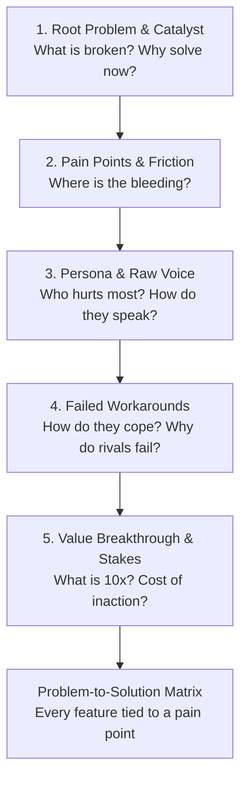

# 🧭 Consultative Problem Discovery Framework

A structured protocol for the **Strategic Advisor** (`@advisor`) and **Project Manager** (`@project-manager`) to conduct conversational discovery interviews. This framework moves beyond surface requirements to uncover the root problems, acute user/business pain points, and why existing solutions fail.

---

## 🎯 The 5-Dimension Discovery Engine



---

### Dimension 1 — The Root Problem & Catalyst
*Move past the feature request ("I need a dashboard") to the underlying reality.*

- **The Core Breakdown:** What is fundamentally broken, inefficient, or missing in the current workflow or market?
- **The Trigger Catalyst:** Why are we building or fixing this *now*? What recent event, metric drop, scale milestone, or market shift forced this priority?
- **Surface Symptom vs. Root Cause:** Is the stated issue the real disease or just a symptom? (e.g. "Users aren't signing up" vs. "Users don't understand what problem the tool solves in the first 5 seconds").

### Dimension 2 — Acute Pain Points & Impact Tiers
*Categorize and rank the specific friction points by severity.*

| Pain Tier | Definition | Examples |
| :--- | :--- | :--- |
| **Tier 1: Critical Blocker (P0)** | Directly loses revenue, breaks compliance, causes active customer churn, or halts operations. | "Manual fraud review takes 48 hours and causes 30% drop-off", "Cannot process enterprise SSO". |
| **Tier 2: Operational Drag (P1)** | Wastes substantial team hours, creates repetitive manual toil, or introduces error risk. | "Engineers spend 8 hours/week copy-pasting API configs between environments". |
| **Tier 3: Psychological / UX Friction (P2)** | Causes confusion, user hesitation, bad perception, or high support ticket volume. | "Users feel overwhelmed by 12 required fields on step 1 of signup". |

### Dimension 3 — Persona Empathy & Raw Voice Extraction
*Understand who feels the pain most acutely and how they express it.*

- **Primary Sufferer:** Who experiences this headache daily? (e.g., The solo founder, the junior engineer, the compliance officer, the end customer).
- **The Decision Maker:** Who approves the purchase, signoff, or migration? What do they care about? (ROI, risk reduction, speed).
- **Raw User Verbatim:** How do users describe the problem when venting to a colleague or on forums? (Avoid polished corporate jargon; capture raw phrases like *"I hate having to manually reconcile these CSVs every Friday night"*).

### Dimension 4 — Current Workarounds & Competitive Deficiencies
*Examine how people are surviving today and why alternatives fall short.*

- **The 'Band-Aid' Hack:** How is the user coping right now without this product/feature? (e.g. Messy Google Sheets, Zapier spaghetti, manual email chains, terminal scripts).
- **Why Existing Alternatives Fail:** Why can't they just use Competitor X or an off-the-shelf SaaS?
  - *Too bloated / expensive for their specific use case?*
  - *Lacks critical integration / flexibility?*
  - *Requires weeks of onboarding / steep learning curve?*
  - *Built for enterprise when they need self-serve?*

### Dimension 5 — Value Breakthrough & Quantified Stakes
*Define what a 10x solution delivers and quantify what happens if nothing changes.*

- **The 10x Breakthrough:** What makes the new solution radically better, not just 10% faster? (e.g., "Instant 1-click verification vs. 48-hour manual review").
- **Quantified Cost of Inaction:** What is the tangible cost if this problem is ignored for the next 6 months? (e.g., "$15,000/mo in lost leads", "20 engineering hours/week wasted", "Customer churn exceeding 12%").
- **The Core Metric of Relief:** What single metric proves the pain point has been eliminated? (e.g. Time-to-first-value < 60s, Churn < 2%, Support tickets reduced by 50%).

---

## 💬 Consultative Probing Directives

When engaging in discovery dialogues, follow these conversational rules:

1. **The "5 Whys" Probing Rule:**
   - When the user states a feature request, ask *why* at least twice:
     - User: *"We need an automated report export feature."*
     - Advisor: *"What specific decision or meeting is that report used for? Who reads it, and what happens when they don't have it on time?"*
2. **Quantify the Bleeding:**
   - Always probe for concrete numbers: *"How many hours a week does this manual process take today?"* or *"What percentage of users abandon at this step?"*
3. **Conversational Pacing (No Question Dumps):**
   - **DO NOT** dump 8 questions in a single wall of text.
   - Ask **1–2 targeted questions per turn**. Reflect what you heard, summarize the insight, and probe deeper into the next dimension.
4. **Constructive Challenge:**
   - If a proposed feature doesn't seem to solve the underlying pain point, gently challenge: *"If we build X, will that actually stop users from dropping off, or is the confusion happening earlier during Y?"*

---

## 📊 Problem-to-Solution Lineage Matrix Template

Every problem uncovered during consultative discovery must map cleanly to planned features and UI components:

```markdown
### 🔗 Problem-to-Solution Lineage Matrix

| # | Identified Pain Point | Severity | Current Workaround | Proposed Solution / Feature | Success Metric |
| :- | :--- | :--- | :--- | :--- | :--- |
| **P-1** | [e.g. 48-hour verification delay causes 30% drop-off] | P0 (Critical) | [Manual staff email review] | [Automated real-time Step Function evaluator] | [Verification time < 3s, drop-off < 5%] |
| **P-2** | [e.g. Confusing multi-tier pricing causes checkout hesitation] | P1 (High) | [Users emailing support for custom quotes] | [Interactive self-serve pricing calculator with instant ROI preview] | [Direct checkout conversion +25%] |
| **P-3** | [e.g. Developers struggle to integrate SDK due to missing code snippets] | P2 (Medium) | [Searching GitHub issues & Slack threads] | [Interactive tabbed SDK quickstart in Next.js/Python/cURL] | [Time-to-first-hello-world < 2 mins] |
```
