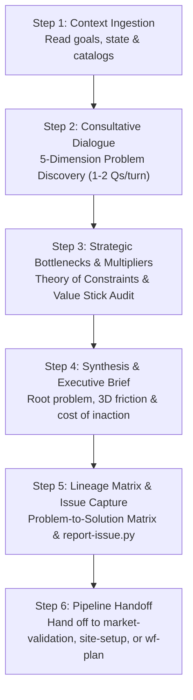
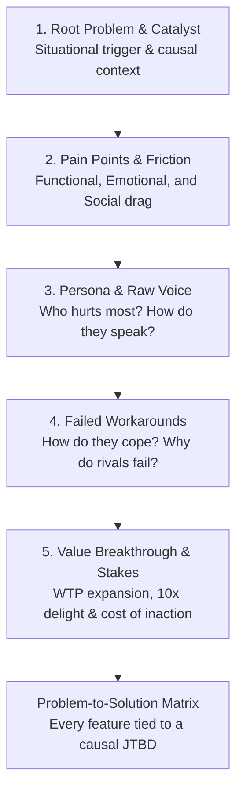

# Skill: /wf-advisor — Universal Strategic Advisory & Problem Discovery

Universal consultative problem discovery, strategic trade-off evaluation, and architecture guidance. Unpacks root problems, customer pain points, failed workarounds, and business bottlenecks before building.

Operates as an **on-demand universal skill** accessible by the primary chat assistant, `@project-manager`, `@marketer`, or any executing subagent without requiring an `@advisor` persona handoff or context switch.

---

## 🧭 When to Use

- **Project Onboarding / Ideation:** When starting a new project and you want to flesh out the core problem, customer pain points, and business model before jumping into code or design.
- **New Feature Definition:** When you have a feature idea and need to validate the underlying user pain and avoid feature creep.
- **Architectural & Technical Dilemmas:** When deciding between competing technical paths, cloud providers, or schema designs.
- **Diagnosing Strategic Bottlenecks:** When conversion drop-off, churn, unit economics, or team friction is occurring and you need root-cause Theory of Constraints diagnosis.
- **Strategic Sync Reviews (`/wf-sync --strategy`):** When evaluating product-market fit, auditing value stick impact, and refining testable hypotheses.

---

## 💬 Usage

```bash
/wf-advisor                              # Start an open-ended strategic advisory conversation
/wf-advisor [topic or dilemma]          # Focus the consultation on a specific problem or idea
/wf-consult [topic or dilemma]          # Alias for /wf-advisor
```

---

## 🛠️ The Consultation Protocol



---

### Step 1 — Context Ingestion

Before speaking, scan active workspace context to ground the consultation:
1. `workforces/workstate.md` (active tasks, sprint priorities, and bottlenecks)
2. `docs/product-brief.md` or `docs/brand-context.md` (if available)
3. `workforces/knowledge-catalog/` (if available)

---

### Step 2 — Consultative Discovery Dialogue (5D JTBD Engine)

Engage the user in an active, step-by-step discovery dialogue using the **5-Dimension JTBD Discovery Engine**:



1. **Root Problem & Situational Catalyst:** What is fundamentally broken? What specific situational trigger prompted the user to seek a solution today?
2. **3D Pain Points & Friction:** What hurts most across **Functional tasks**, **Emotional anxieties**, and **Social perceptions**?
3. **Persona & Raw Voice:** Who suffers daily? How do they express their frustration in their own raw words?
4. **Current Workarounds & Competitor Flaws:** How are people coping today with manual hacks (spreadsheets, manual glue, custom scripts)? Why do existing alternatives fail?
5. **Value Breakthrough & Value Stick Stakes:** How does a 10x breakthrough lengthen the total stick by expanding **Willingness to Pay (WTP)** or lowering **Willingness to Sell (WTS)**? What is the quantified cost of inaction if unsolved for 6 months?

> 💬 **Conversational Directives & Pacing:**
> - **Pacing — 1 to 2 Questions Per Turn:** NEVER dump a checklist of 8 questions. Ask 1–2 sharp questions, reflect what the user said, validate understanding, and probe deeper.
> - **The "5 Whys" Rule:** When the user proposes a solution or feature, gently probe the root motivation (*"What breaks if you don't have this? Who needs this data, and what decision does it drive?"*).
> - **Quantify Impact:** Push for concrete numbers (hours wasted, conversion drop-off %, dollars leaked).
> - **Constructive Challenge:** If a proposed approach addresses symptoms rather than the disease, or risks over-engineering, present the counter-perspective constructively.

---

### Step 3 — Scientific Hypothesis & Strategic Multipliers Protocol

When evaluating strategic initiatives, audit progress across the **4-Step Executive Decision Sequence**:

1. **JTBD & Customer Validation:** State the situational trigger and causal job. Reject solutions lacking situational evidence.
2. **Value Stick Audit:** Verify the initiative expands Customer Delight ($\text{WTP} - \text{Price}$) or Supplier Surplus ($\text{Cost} - \text{WTS}$) rather than zero-sum margin extraction.
3. **Growth Loops & Platform Dynamics:** Map closed compounding loops (viral, UGC, paid reinvestment, marketplace) and direct/indirect network effects.
4. **Unit Economics & Execution (Sense-Seize-Transform):** Check $\text{LTV:CAC} \ge 3\times$ and Payback $< 12\text{mo}$. Identify bottlenecks using Theory of Constraints and kill zombie experiments breaching thresholds via `hypothesis.py --kill`.

---

### Step 4 — Strategic Bottleneck Diagnosis (Theory of Constraints)

Before committing engineering resources, identify the single governing constraint limiting throughput:

1. **Market Awareness / Demand:** Top-of-funnel bottleneck; users don't know the solution exists.
2. **Activation / Onboarding Friction:** Users drop off before experiencing the core "aha" moment.
3. **Core Value Delivery:** Product fails to reliably solve the primary Job-to-be-Done.
4. **Retention / Churn:** Users derive initial value but churn due to missing habits, workflows, or compounding utility.
5. **Unit Economics / Margins:** CAC exceeds LTV thresholds or payback period exceeds 12 months.

*Rule: Subordinate all non-bottleneck optimizations to solving the single primary constraint.*

---

### Step 5 — Strategic Synthesis (Executive Advisory Brief)

Once the problem space and bottlenecks are clarified, present a structured **Executive Advisory Brief**:

```markdown
## 💡 Executive Advisory Brief

### 1. Root Problem & Situational Trigger
- **Situational Trigger:** [When X occurs...]
- **Core Job-to-be-Done:** [I want to Y so I can achieve Z (Functional, Emotional, Social)]

### 2. Acute Pain Points Breakdown (3D JTBD)
- **Functional Drag:** [e.g. 48hr delay causing 30% drop-off]
- **Emotional Anxiety:** [e.g. Fear of data breach during manual audit]
- **Social Perception:** [e.g. Frustration from appearing unorganized to executive board]

### 3. Current Workarounds & Why Existing Tools Fail
[How users cope today and why competitors are insufficient]

### 4. Value Stick Impact & Quantified Cost of Inaction
- **WTP / WTS Vector:** [Expands customer WTP by eliminating 8 hrs/wk of toil]
- **Cost of Inaction:** [Stakes if left unsolved for 6 months]

### 5. Governing Bottleneck (Theory of Constraints)
[Primary constraint diagnosed: Awareness | Activation | Value Realization | Retention | Unit Economics]

### 6. Recommended Strategic Direction & 10x Breakthrough
[Clear recommendation with trade-off analysis and growth loop feedback mechanism]
```

---

### Step 6 — Problem-to-Solution Lineage Matrix & Automated Issue Inbox Capture

Generate a concrete mapping of pain points to solution requirements:

```markdown
### 🔗 Problem-to-Solution Lineage Matrix

| # | Identified Pain Point / JTBD Trigger | Severity | Proposed Solution / Feature | Value Stick Wedge Impact | Success Metric |
| :- | :--- | :--- | :--- | :--- | :--- |
| **P-1** | [Situational trigger / pain point 1] | P0 | [Proposed feature] | Expands WTP (+Delight) | [Measurable metric] |
| **P-2** | [Situational trigger / pain point 2] | P1 | [Proposed feature] | Lowers WTS (+Efficiency) | [Measurable metric] |
```

> 🚨 **Mandatory Tool Call**: For every proposed feature, roadmap phase, or architectural solution agreed upon with the user, execute `report-issue.py` with session lineage before presenting completion text:

```bash
# Capture each proposed feature / horizon into the issue inbox with session sync:
python3 .agents/skills/issue-tracker/scripts/report-issue.py \
    --title "[Feature / Concept Name]" \
    --type idea \
    --severity P0 \
    --reporter strategist \
    --session-id "[seq]" \
    --session-file "workforces/session-context/<seq>_<date>_<slug>.md" \
    --description "[Core problem, acute pain, and 10x value proposition]" \
    --suggested-action "[Implementation plan & target workflow (e.g. site-setup, feature-research)]" \
    --evolution-note "Advisory conclusion: validated against pain point matrix." \
    --sync-session
```
*(Fallback: `python3 skills/issue-tracker/scripts/report-issue.py ...`)*

---

### Step 7 — Pipeline Handoff

Based on the agreed direction, provide seamless transitions to the next workforce workflows without requiring persona handoffs:

- **For Rapid Market Validation:** Hand off to market validation (`market-validation` skill) to pretotype demand and test willingness to pay before building.
- **For New Websites / SaaS Apps:** Hand off to site setup (`site-setup` skill) with Marketing & `@designer`.
- **For New Features:** Hand off to feature research (`feature-research` skill).
- **For Strategic Task Execution:** Hand off to `/wf-plan` or Antigravity parallel execution (`agent-parallelization`).
