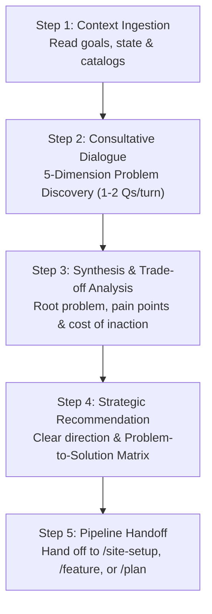

# /advisor — Strategic Advisory & Problem Discovery

Engage with the **Strategic Advisor** (`@advisor`) in an interactive, consultative dialogue to unpack what problems are really being solved, identify acute pain points, evaluate strategic trade-offs, and establish clear direction before building.

---

## 🧭 When to Use

- **Project Onboarding / Ideation:** When starting a new project and you want to flesh out the core problem, customer pain points, and business model before jumping into code or design.
- **New Feature Definition:** When you have a feature idea and need to validate the underlying user pain and avoid feature creep.
- **Architectural & Technical Dilemmas:** When deciding between competing technical paths, cloud providers, or schema designs.
- **Diagnosing Bottlenecks:** When conversion drop-off, churn, or team friction is occurring and you need root-cause diagnosis.

---

## 💬 Usage

```bash
/advisor                              # Start an open-ended strategic advisory conversation
/advisor [topic or dilemma]          # Focus the consultation on a specific problem or idea
/consult [topic or dilemma]          # Alias for /advisor
```

---

## 🛠️ The Consultation Protocol



---

### Step 1 — Context Ingestion

Before speaking, `@advisor` quickly scans active workspace context:
1. `workforces/workstate.md` (active tasks and priorities)
2. `docs/product-brief.md` or `docs/brand-context.md` (if available)
3. `workforces/knowledge-catalog/` (if available)

---

### Step 2 — Consultative Discovery Dialogue

`@advisor` engages you in an active, step-by-step conversation using the **5-Dimension Discovery Engine**:

1. **Root Problem & Catalyst:** What is fundamentally broken? What triggered the need to solve this now?
2. **Pain Points & Friction:** What hurts most? (Categorized by Critical Blockers, Operational Drag, and UX Friction).
3. **Persona & Raw Voice:** Who suffers daily? How do they express their frustration?
4. **Current Workarounds:** How are people coping today with manual hacks? Why do competitor tools fail?
5. **Value Breakthrough & Stakes:** What does a 10x solution look like? What is the quantified cost of doing nothing?

> 💬 **Pacing Directives:**
> - Questions are asked **1 to 2 at a time**, reflecting what you've said before digging deeper.
> - Uses the **"5 Whys"** to separate symptoms from root causes.
> - Quantifies friction in hours, dollars, or drop-off rates.

---

### Step 3 — Strategic Synthesis

Once the problem space is clarified, `@advisor` presents a structured **Executive Advisory Brief**:

```markdown
## 💡 Executive Advisory Brief

### 1. Root Problem Statement
[Concise summary of the real breakdown, moving past surface symptoms]

### 2. Acute Pain Points Breakdown
- **Tier 1 (Critical Blocker):** [e.g. 48hr delay causing 30% drop-off]
- **Tier 2 (Operational Drag):** [e.g. 8 hrs/week spent on manual reconciliation]
- **Tier 3 (UX Friction):** [e.g. 12-field signup form causing hesitation]

### 3. Current Workarounds & Why Existing Tools Fail
[How users cope today and why competitors are insufficient]

### 4. Quantified Cost of Inaction
[Stakes if left unsolved for 6 months]

### 5. Recommended Strategic Direction & 10x Breakthrough
[Clear recommendation with trade-off analysis]
```

---

### Step 4 — Problem-to-Solution Lineage Matrix

`@advisor` generates a concrete mapping of pain points to solution requirements:

```markdown
### 🔗 Problem-to-Solution Lineage Matrix

| # | Identified Pain Point | Severity | Proposed Solution / Feature | Success Metric |
| :- | :--- | :--- | :--- | :--- |
| **P-1** | [Pain point 1] | P0 | [Proposed feature] | [Measurable metric] |
| **P-2** | [Pain point 2] | P1 | [Proposed feature] | [Measurable metric] |
```

---

### Step 5 — Pipeline Handoff

Based on the agreed direction, `@advisor` provides seamless transitions to the next workforce workflows:

- **For New Websites / SaaS Apps:** Hand off to `/site-setup` (Step 1 Marketing & Step 2 `@designer`).
- **For New Features:** Hand off to `/feature [idea]` (Phase 1 Gap Analysis & Phase 3 PRD).
- **For Strategic Task Execution:** Hand off to `/plan` or `/work`.

