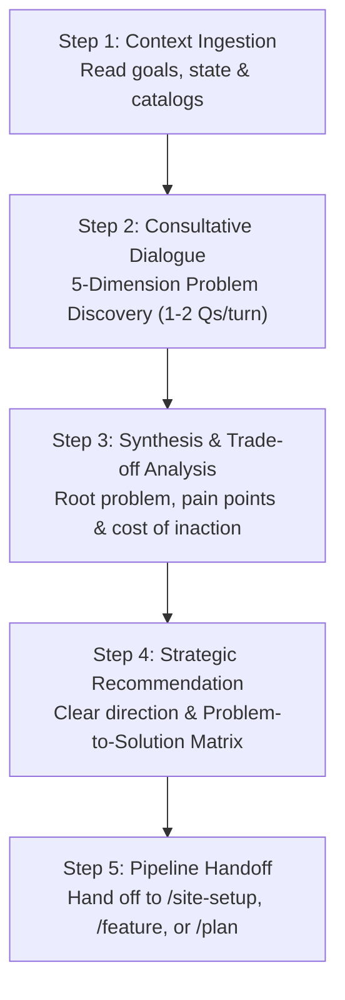

# /advisor — Strategic Advisory & Problem Discovery

Engage with the **Strategic Advisor** (`@advisor`) in an interactive, consultative dialogue to unpack what problems are really being solved, identify acute pain points, evaluate strategic trade-offs, and establish clear direction before building.

---

## 🧭 When to Use

- **Project Onboarding / Ideation:** When starting a new project and you want to flesh out the core problem, customer pain points, and business model before jumping into code or design.
- **New Feature Definition:** When you have a feature idea and need to validate the underlying user pain and avoid feature creep.
- **Architectural & Technical Dilemmas:** When deciding between competing technical paths, cloud providers, or schema designs.
- **Diagnosing Bottlenecks:** When conversion drop-off, churn, or team friction is occurring and you need root-cause diagnosis.

---

## 💬 Usage

```bash
/advisor                              # Start an open-ended strategic advisory conversation
/advisor [topic or dilemma]          # Focus the consultation on a specific problem or idea
/consult [topic or dilemma]          # Alias for /advisor
```

---

## 🛠️ The Consultation Protocol



---

### Step 1 — Context Ingestion

Before speaking, `@advisor` quickly scans active workspace context:
1. `workforces/workstate.md` (active tasks and priorities)
2. `docs/product-brief.md` or `docs/brand-context.md` (if available)
3. `workforces/knowledge-catalog/` (if available)

---

### Step 2 — Consultative Discovery Dialogue (JTBD & Value Stick)

`@advisor` engages you in an active, step-by-step conversation using the **5-Dimension JTBD Discovery Engine**:

1. **Root Problem & Situational Catalyst:** What is fundamentally broken? What specific situational trigger prompted the user to seek a solution today?
2. **3D Pain Points & Friction:** What hurts most across **Functional tasks**, **Emotional anxieties**, and **Social perceptions**?
3. **Persona & Raw Voice:** Who suffers daily? How do they express their frustration in their own words?
4. **Current Workarounds & Competitor Flaws:** How are people coping today with manual hacks? Why do existing alternatives fail?
5. **Value Breakthrough & Value Stick Stakes:** How does a 10x solution lengthen the total stick (expanding **WTP** or reducing **WTS**)? What is the quantified cost of doing nothing?

> 💬 **Pacing Directives:**
> - Questions are asked **1 to 2 at a time**, reflecting what you've said before digging deeper.
> - Uses the **"5 Whys"** to separate symptoms from causal triggers.
> - Quantifies friction in hours, dollars, or conversion drop-off rates.

---

### Step 3 — Strategic Synthesis (Executive Advisory Brief)

Once the problem space is clarified, `@advisor` presents a structured **Executive Advisory Brief**:

```markdown
## 💡 Executive Advisory Brief

### 1. Root Problem & Situational Trigger
- **Situational Trigger:** [When X occurs...]
- **Core Job-to-be-Done:** [I want to Y so I can achieve Z (Functional, Emotional, Social)]

### 2. Acute Pain Points Breakdown (3D JTBD)
- **Functional Drag:** [e.g. 48hr delay causing 30% drop-off]
- **Emotional Anxiety:** [e.g. Fear of data breach during manual audit]
- **Social Perception:** [e.g. Frustration from appearing unorganized to executive board]

### 3. Current Workarounds & Why Existing Tools Fail
[How users cope today and why competitors are insufficient]

### 4. Value Stick Impact & Quantified Cost of Inaction
- **WTP / WTS Vector:** [Expands customer WTP by eliminating 8 hrs/wk of toil]
- **Cost of Inaction:** [Stakes if left unsolved for 6 months]

### 5. Recommended Strategic Direction & 10x Breakthrough
[Clear recommendation with trade-off analysis and growth loop feedback mechanism]
```

---

### Step 4 — Problem-to-Solution Lineage Matrix & Automated Issue Inbox Capture

`@advisor` generates a concrete mapping of pain points to solution requirements:

```markdown
### 🔗 Problem-to-Solution Lineage Matrix

| # | Identified Pain Point / JTBD Trigger | Severity | Proposed Solution / Feature | Value Stick Wedge Impact | Success Metric |
| :- | :--- | :--- | :--- | :--- | :--- |
| **P-1** | [Situational trigger / pain point 1] | P0 | [Proposed feature] | Expands WTP (+Delight) | [Measurable metric] |
| **P-2** | [Situational trigger / pain point 2] | P1 | [Proposed feature] | Lowers WTS (+Efficiency) | [Measurable metric] |
```

> 🚨 **Mandatory Tool Call**: For every proposed feature, roadmap phase, or architectural solution agreed upon with the user, `@advisor` MUST execute `report-issue.py` with session lineage before presenting completion text:

```bash
# Capture each proposed feature / horizon into the issue inbox with session sync:
python3 .agents/skills/issue-tracker/scripts/report-issue.py \
    --title "[Feature / Concept Name]" \
    --type idea \
    --severity P0 \
    --reporter advisor \
    --session-id "[seq]" \
    --session-file "workforces/session-context/<seq>_<date>_<slug>.md" \
    --description "[Core problem, acute pain, and 10x value proposition]" \
    --suggested-action "[Implementation plan & target workflow (e.g. /site-setup, /feature)]" \
    --evolution-note "Advisory conclusion: validated against pain point matrix." \
    --sync-session
```
*(Fallback: `python3 skills/issue-tracker/scripts/report-issue.py ...`)*

---

### Step 5 — Pipeline Handoff

Based on the agreed direction, `@advisor` provides seamless transitions to the next workforce workflows:

- **For Rapid Market Validation:** Hand off to `/validate-idea [idea]` to pretotype demand and test willingness to pay before building.
- **For New Websites / SaaS Apps:** Hand off to `/site-setup` (Step 1 Marketing & Step 2 `@designer`).
- **For New Features:** Hand off to `/feature [idea]` (Phase 1 Gap Analysis & Phase 3 PRD).
- **For Strategic Task Execution:** Hand off to `/plan` or `/work`.


