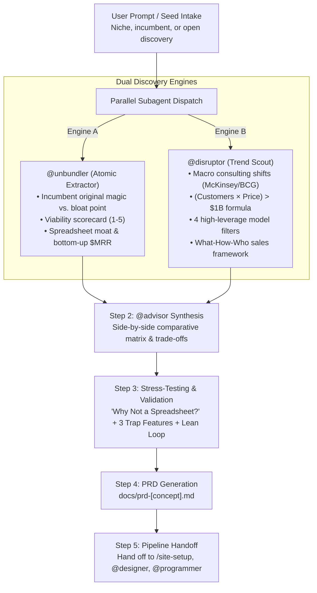

# /ideate — Dual-Engine Product Ideation & Incubation Pipeline

The end-to-end ideation and concept incubation engine for Workforces. Whether unbundling bloated software giants or uncovering high-margin market disruptions, `/ideate` leverages parallel subagent research to deliver build-ready, revenue-tested micro-SaaS opportunities.

Coordinated by the **Strategic Advisor** (`@advisor`) with specialized parallel execution by the **Atomic SaaS Extractor** (`@unbundler`) and the **Market Disruption Scout** (`@disruptor`).

---

## 🧭 Workflow Overview



---

## 💬 Usage

```bash
/ideate                              # Open-ended dual-engine ideation across both methodologies
/ideate [niche or industry]          # Research atomic & disruptive opportunities in a target market
/ideate unbundle [bloated tool]      # Target a specific incumbent for atomic feature extraction (@unbundler)
/ideate disrupt [macro trend]        # Target macro industry waves and high-leverage market gaps (@disruptor)
```

---

## 🛠️ Step-by-Step Pipeline

---

### Step 0 — Intake & Discovery Seed

The user provides a starting impulse, or `@advisor` prompts for a seed:
1. **Industry / Niche:** (e.g. *LegalTech for solo practitioners*, *Property management for Airbnb hosts*, *Fitness coaching*)
2. **Bloated Software Incumbent:** (e.g. *Salesforce, Jira, HubSpot, Shopify, QuickBooks*)
3. **Open Mode:** *"Surprise me with high-leverage, validated micro-SaaS opportunities."*

---

### Step 1 — Parallel Subagent Dispatch

The Coordinator immediately dispatches both discovery engines simultaneously:

#### Engine A: `@unbundler` (Atomic Micro-SaaS Extractor)
1. Isolates the bloated incumbent's **1-minute magic moment** vs. modern **bloat points**.
2. Evaluates the **Viability Scorecard (1–5)**:
   - Frequency of Use
   - Willingness to Pay
   - Standalone Integrity
   - Spreadsheet Moat
3. Computes bottom-up TAM/SAM/SOM and financial milestones (Day 90, Year 1, Year 2).

#### Engine B: `@disruptor` (Market Disruption & Trend Scout)
1. Analyzes **macro industry shifts** from consulting research (McKinsey, BCG, Bain) and startup funding trends.
2. Validates the **Billion-Dollar Market Formula**:
   $$\text{Target Customers} \times \text{Product Price} > \$1\text{ Billion}$$
3. Filters through the **4 High-Leverage Model Criteria**:
   - Recurring Subscription Revenue
   - $\ge 70\%$ Gross Profit Margins
   - Technology-Scaled (Zero headcount/consulting drag)
   - 100% Owned Product / IP
4. Maps the **"What-How-Who"** transformational sales framework.

---

### Step 2 — `@advisor` Strategic Synthesis & Comparative Matrix

`@advisor` aggregates the findings from both engines into a concise, scannable **Opportunity Matrix**:

```markdown
## 💡 Executive Opportunity Matrix

| Opportunity | Source Engine | Core Angle | TAM / Sizing | Viability Score | Primary Moat |
| :--- | :--- | :--- | :--- | :--- | :--- |
| **Concept 1** | `@unbundler` | [Atomic extracted feature] | [$MRR Day 90 / Yr 1] | 4.8 / 5 | [Spreadsheet Moat] |
| **Concept 2** | `@unbundler` | [Atomic extracted feature] | [$MRR Day 90 / Yr 1] | 4.5 / 5 | [Workflow Speed] |
| **Concept 3** | `@disruptor` | [Macro trend disruption] | [>$1B Market Math] | 4.9 / 5 | [Proprietary Tech] |
| **Concept 4** | `@disruptor` | [Macro trend disruption] | [>$1B Market Math] | 4.6 / 5 | [Regulatory Wave] |
```

`@advisor` asks 1–2 targeted questions to help the user choose the concept that best matches their strengths, tech stack preferences, and go-to-market channels.

---

### Step 3 — Stress-Testing & Validation

Before writing specs, the selected concept undergoes rigorous stress-testing:

1. **The "Why Not a Spreadsheet?" Test:** Validating the exact UX mechanism (drag-and-drop, email automation, keyboard flow) that makes this 10x faster than a free sheet.
2. **The 3 Dangerous Trap Features:** Locking in the exact 3 features that founders will be tempted to build that would ruin simplicity.
3. **The Lean Learning Loop:** Designing a 48-hour smoke test or waitlist landing page to validate buyer appetite before writing code.

---

### Step 4 — Micro-SaaS PRD Generation & Issue Inbox Registration

The engine compiles a complete, build-ready PRD saved to `docs/prd-[concept-name].md` containing:
- **Product Name & One-Line Thesis**
- **Target Persona & Acute Pain Points**
- **Problem-to-Solution Lineage Matrix**
- **Strict Non-Goals (Hard non-negotiables)**
- **Core User Flow & UX Requirements**
- **Minimal Data Schema & Entities**
- **Recommended Tech Stack**
- **Pricing, Monetization & Lean Validation Plan**

> 🚨 **Mandatory Tool Call**: Once the winning concept and PRD are defined, `@advisor` MUST execute `report-issue.py` to register the concept in `workforces/issues/inbox/` with session lineage:

```bash
# Capture winning micro-SaaS concept directly into the inbox with session sync:
python3 .agents/skills/issue-tracker/scripts/report-issue.py \
    --title "Micro-SaaS Concept: [Product Name]" \
    --type idea \
    --severity P0 \
    --reporter advisor \
    --session-id "[seq]" \
    --session-file "workforces/session-context/<seq>_<date>_<slug>.md" \
    --file "docs/prd-[concept-name].md" \
    --description "[One-line thesis & 10x value breakthrough]" \
    --suggested-action "Execute /site-setup with @designer and @programmer to scaffold MVP" \
    --evolution-note "Selected winning concept from dual-engine ideation matrix." \
    --sync-session
```
*(Fallback: `python3 skills/issue-tracker/scripts/report-issue.py ...`)*

---

### Step 5 — Pipeline Handoff

With the PRD generated and issue registered in the inbox, `@advisor` transitions directly into the build pipeline:
- **Run `/site-setup`** → Pre-populates `docs/brand-context.md`, defines design tokens with `@designer`, and scaffolds tech with `@programmer`.
- **Run `/feature`** → For modular architectural breakdowns.
- **Run `/work`** → Executes sprint tasks.


---

## 🌟 Greenfield / First-Install Onboarding Hook

When Workforces is installed in a fresh codebase, the AI checks if project files exist. If the codebase is empty, it greets the user with:

> *"Welcome to Workforces! I notice this is a fresh project. How would you like to begin?"*
> 1. 💡 **Explore Winning SaaS Ideas:** Run `/ideate` to discover unbundled atomic micro-SaaS and market disruption opportunities.
> 2. 🧭 **Hash Out Strategy for an Existing Idea:** Run `/advisor` to conduct a 5-dimension problem discovery interview.
> 3. 🏗️ **Start Direct Setup & Scaffolding:** Run `/site-setup` to configure brand context, design tokens, and scaffolding.
