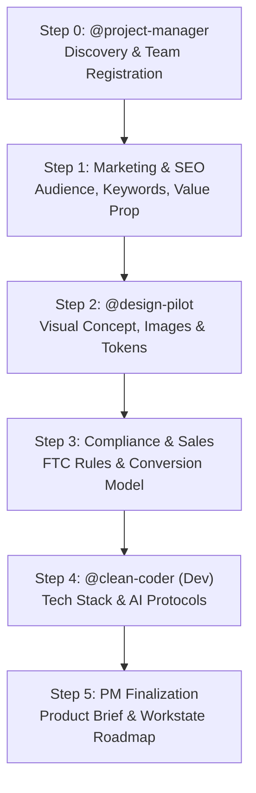

# /site-setup — Greenfield Site Setup & Product Brief Pipeline

The end-to-end conversational onboarding workflow for launching a new website, web app, or SaaS property in an empty codebase. 

Coordinated by the **Project Manager** (`@project-manager`) with specialized handoffs across **Marketing**, **Design Pilot** (`@design-pilot`), **Compliance/Sales**, and **Engineering** (`@clean-coder`).

---

## 🧭 Workflow Overview



---

## Step 0 — Strategy & Scope Discovery (`@project-manager`)

Gather foundational context from the user:

1. **What is the product or business name?**
2. **What type of site are we building?**
   - SaaS / Web App
   - Local Service Lead Generation (e.g. contractor/home services network)
   - Direct Service Business (e.g. agency, clinic, law firm)
   - E-commerce / D2C Store
   - Blog / Content / Media Hub
   - Developer Tool / Open Source
3. **What is the primary business model?**
   - **Lead Generation / Affiliate**: Requires legal disclaimers, contractor matching disclosures, no false guarantees. Handled by `@compliant-page-builder`.
   - **Direct Service / SaaS / E-commerce**: Business performs work directly. Reviews, pricing tables, and guarantees permitted. Handled by `@page-builder`.
4. **Primary Conversion Action**:
   - Free trial / app signup
   - Lead quote request / phone call
   - Direct checkout / purchase
   - Newsletter subscription

> **PM Action**: Ensure target teams (`design`, `marketing`, `dev`, `compliance`, `sales`) are registered in `workforces/workrules.md` and `workforces/teams/`.

---

## Step 1 — Marketing & Positioning Handoff (`marketing` / `@seo-architect`)

Define the market position and audience resonance before any visual or code work:

1. **Target Customer Persona**:
   - Who is the ideal customer? (Demographics, job title, company size, experience level)
   - What is their #1 urgent pain point right now?
   - How do they describe the problem in their own words?
2. **Core Value Proposition**:
   - Elevator pitch (1 punchy sentence).
   - Key differentiators vs top 2–3 competitors (what makes competitors look generic or outdated).
3. **SEO & Search Intent**:
   - Primary transactional keyword (e.g., *"emergency roof repair dallas"* or *"real-time auth sdk"*).
   - 2–3 secondary long-tail keywords.
4. **Copywriting Script & Hook**:
   - Hook formula: Problem agitate → Differentiated solution → Proof → Single clear CTA.

> **Action**: Populate Section 1 (Business Identity) and Section 2 (Audience) in `docs/brand-context.md`.

---

## Step 2 — Design Pilot Ideation & Visual Prototyping (`@design-pilot`)

Collaboratively brainstorm the visual language, referencing modern award-winning benchmarks to inspire the user:

1. **Design Archetype Exploration**:
   - Benchmark against **Awwwards**, **SiteInspire**, **Dribbble**, **Land-book**, and **Landing.love**.
   - Present 2–3 aesthetic directions:
     - **Editorial Minimalist**: High typography contrast, serif/sans pairing, generous whitespace, monochrome base with single vivid accent.
     - **Neo-Brutalist**: Bold black borders (2–3px), vibrant primary colors, tactile cards, raw geometric typography.
     - **Dark Luxury / High-Tech Clean**: Deep slate backgrounds, crisp micro-borders, subtle glassmorphism, glowing telemetry.
     - **Warm Earthy Organic**: Soft cream/sand backgrounds, warm terracotta/forest green accents, humanist typography.
2. **Anti-Pattern Defense**:
   - Check against [`design-anti-patterns`](../skills/design-anti-patterns/SKILL.md) (reject purple-on-dark glow defaults, gradient keyword pill badges, centered 3-card templates).

3. **AI Concept Image Generation**:
   - Use the `generate_image` tool to render 1–2 visual concept mockups representing the chosen visual mood:
     ```
     generate_image(
       Prompt="Editorial web design mockup of [business concept], [chosen archetype], [primary color] highlights, clean typography, desktop UI view",
       ImageName="concept_mockup_preview",
       AspectRatio="16:9"
     )
     ```
   - Show the generated concept to the user to confirm aesthetic alignment.
4. **Color Palette & Typography Tokens**:
   - Primary Hex, Secondary Hex, Neutral Light, Neutral Dark, Accent.
   - Heading Font (e.g. Space Grotesk, Inter, Plus Jakarta Sans) + Body Font.
5. **Image Queue Initialization**:
   - Populate planned image slots in `workforces/images.json` (Hero, Features, Testimonial, Preview).

> **Action**: Update `docs/brand-context.md` (Visual Identity) and populate `workforces/images.json`.

---

## Step 3 — Sales & Compliance Review Handoff (`compliance` / `sales`)

Verify trust signals, legal disclosures, and conversion mechanics:

1. **For Lead Generation Sites**:
   - Inject mandatory FTC / affiliate disclaimer:
     > *"Disclaimer: [Domain] is a free referral service connecting homeowners with independent contractors. We do not perform contractor services directly. All contractors are independently licensed."*
   - Verify zero false claims (*"100% guaranteed"*, *"Our licensed crew"*).
2. **For SaaS / Direct Service Sites**:
   - Formulate pricing tiers (Free / Pro / Enterprise or Standard / Premium).
   - Guarantee statements and refund policies.

---

## Step 4 — Dev & Technology Scaffolding Handoff (`dev` / `@clean-coder`)

Select framework, cloud hosting, and configure framework-aware AI protocols:

1. **Tech Stack Selection**:
   - **Frontend**: Next.js (App Router), Vite / React, Astro, Plain HTML/CSS, Python (FastAPI/Django).
   - **Styling**: Vanilla CSS / CSS Modules / Tailwind (confirm version) / Design Tokens.
   - **Cloud Hosting**: Cloudflare Pages / Workers, AWS Amplify, Google Firebase / Cloud Run, Docker.
2. **Scaffolding Execution (Under Safeguard Rule)**:
   - Run the scaffolding command in non-interactive mode.
   - 🛑 **Safeguard**: If the command fails, blocks, or requires interactive terminal answers:
     - **DO NOT hand-code framework boilerplate from scratch.**
     - **STOP execution**, output the command for the user to run in their terminal, and wait for confirmation.
3. **Design Tokens Integration**:
   - Write CSS custom properties to `src/styles/tokens.css` based on brand context colors and typography.
4. **AI Protocol Files Generation**:
   - Generate language-specific `public/robots.txt`, `public/llms.txt`, `public/ai.txt`, `public/.well-known/ai-plugin.json`, and dynamic/static `sitemap` (e.g. `src/app/sitemap.ts` with `force-static` for Next.js).

---

## Step 5 — Brief Compilation & Workstate Promotion (`@project-manager`)

1. **Compile `docs/product-brief.md`**:
   Ensure all **7 Mandatory Sections** are documented with zero remaining placeholders:
   - 1. Project Summary & Goals
   - 2. Creative Concept & Narrative
   - 3. Layout Specification (Header, Hero, Feature Grid, Social Proof, CTA/Pricing, Footer)
   - 4. Visual Style Guide & Tokens
   - 5. Content Direction & Headlines
   - 6. Technical Stack & Hosting Architecture
   - 7. Implementation Notes, Compliance & Tool Sequencing
2. **Update `workforces/workstate.md`**:
   - Mark task 1 (`Complete /site-setup`) complete.
   - Unblock P0 tasks:
     - Task 2: Build Homepage Component Structure
     - Task 3: Generate Image Queue via `/work` (`workforces/images.json`)
     - Task 4: SEO & Schema Validation

---

## Completion Checklist

- [ ] Project category & business model confirmed (Lead Gen vs Direct Service/SaaS)
- [ ] Target audience & value proposition documented in `docs/brand-context.md`
- [ ] Design archetype & visual concept preview generated via `generate_image`
- [ ] CSS design tokens extracted to `src/styles/tokens.css`
- [ ] `workforces/images.json` populated with required assets
- [ ] Framework scaffolded (under installer safeguard rule)
- [ ] Framework-aware AI protocol files generated (`robots.txt`, `llms.txt`, `ai.txt`, `sitemap`)
- [ ] `docs/product-brief.md` completed with all 7 mandatory sections
- [ ] `workforces/workstate.md` updated with unblocked build tasks
