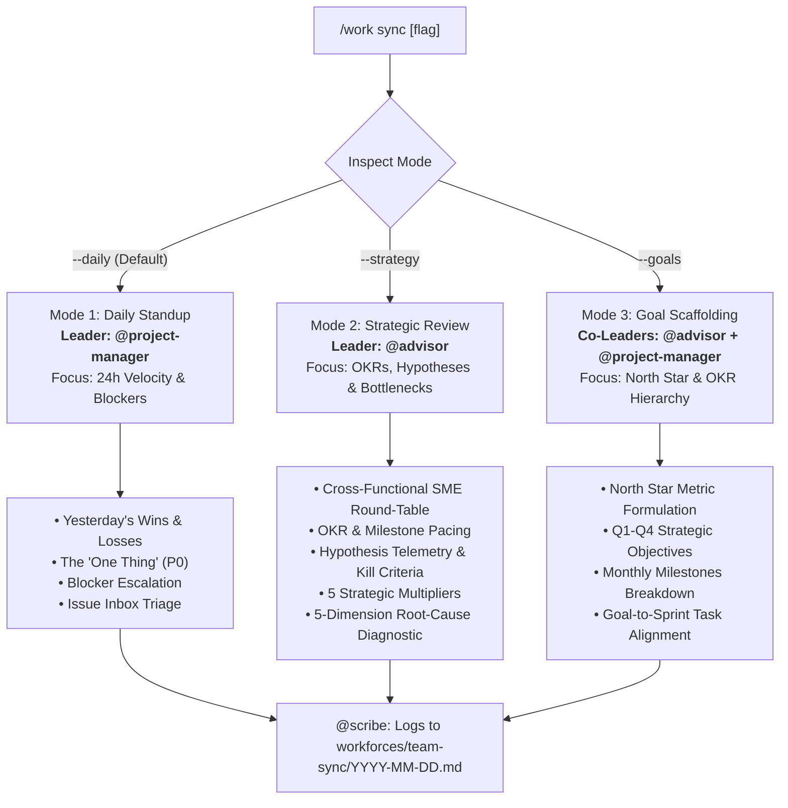

# /work sync — Multi-Mode Team Sync & Strategic Alignment

A unified meeting engine for daily execution, strategic course-correction, goal scaffolding, and hypothesis tracking. Led dynamically by `@project-manager` (for execution standups) or `@advisor` (for strategic reviews and diagnostics).

---

## 🧭 Meeting Modes & Usage

```bash
/work sync                # Default: Daily Execution Standup (Led by @project-manager)
/work sync --daily        # Explicit: 5-min tactical standup on 24h wins, blockers & "The One Thing"
/work sync --strategy     # Strategic Review: OKRs, KPIs, Hypothesis Pacing, SME Round-Table (Led by @advisor)
/work sync --goals        # Goal & Milestone Scaffolding: Setup/reset Annual North Star & Q1-Q4 OKRs
```

---

## 🚦 Meeting Router & Leadership Matrix



---

# Mode 1: Daily Execution Standup (`/sync --daily`)

**Meeting Leader:** `@project-manager`  
**Duration Target:** 2–5 minutes  
**Primary Goal:** Unblock the team, lock in today's single most critical commitment, and triage incoming issues.

### Step D1 — Ingest Daily State
1. Read `workforces/workstate.md` for active, pending, and completed sprint tasks.
2. Read `workforces/issues/inbox/` for new bugs, tech debt, or spontaneous ideas logged by agents or user.
3. Check GitHub queue (`gh pr list`, `gh issue list`) for external PR review requests.

### Step D2 — Review 24h Wins & Roadblocks
- **🏆 Wins:** What was marked completed in `workstate.md` since the last standup?
- **⚠️ Roadblocks:** What tasks are currently stalled, waiting on credentials, or blocked by API dependencies?

### Step D3 — Lock In "The One Thing"
- Identify the single highest-leverage task for today (**P0 Priority**).
- Verify that every active team has exactly one primary focus.

### Step D4 — Triage Issue Inbox
- Review pending files in `workforces/issues/inbox/*.md`.
- Promote P0/P1 items to `workstate.md` and GitHub Issues.
- Move triaged files to `workforces/issues/triaged/` or `workforces/issues/completed/` (if rejected).

### Step D5 — Present Standup Report
```markdown
## 🔄 Daily Standup — YYYY-MM-DD

### 🏆 24h Wins
- [x] Task A — Description of achievement.

### ⚠️ Roadblocks & Immediate Blockers
- [ ] Task B — Blocked on staging OAuth domain verification (@programmer).

### 🎯 The One Thing Today
> **[Task C Title]** (Priority P0 — Owner: `@programmer`)
> *Why:* Critical path item blocking revenue milestone.

### 📬 Inbox Triage
- Triaged 2 items (1 promoted to P1, 1 logged to backlog).

### 🙋 Help Needed from User
- Approval for staging API key configuration.
```

---

# Mode 2: Strategic Review & Hypothesis Pacing (`/sync --strategy`)

**Meeting Leader:** `@advisor` (Co-pilot: `@project-manager`)  
**Duration Target:** 10–15 minutes  
**Primary Goal:** Align on macro OKRs, evaluate growth/sales hypotheses, enforce kill/pivot criteria, hear from SME subagents, and diagnose why targets are missed.

### Step S1 — Ingest Macro Landscape
1. **Strategic Goals:** Read `workforces/goals/` for current quarter objectives and key results. (If no goals exist, automatically offer to switch to `/sync --goals`).
2. **Active Hypotheses:** Query `skills/hypothesis-tracker/scripts/hypothesis.py --review` for all active experiments in `workforces/hypotheses/running/`.
3. **Velocity & Backlog:** Read `workforces/workstate.md` for completed vs backlog tasks.
4. **Installed Teams:** Read `workforces/workrules.md` and `workforces/teams/` to identify all active domain experts.

### Step S2 — The Cross-Functional SME Subagent Round-Table
The meeting leader actively polls installed team agents for their 1-to-2 sentence domain telemetry, emerging risks, and operational observations:

```markdown
### 🎙️ Cross-Functional SME Round-Table
- **💼 Sales (`@sales`):** Outbound reply rate at 8.2% on Campaign Alpha (target: 12%). CTOs are responding to direct metric teasers but ignoring long decks.
- **📈 Growth (`@growth`):** Programmatic SEO indexation reached 450 pages; Google Search Console impressions +32% WoW. Activation drop-off detected on step 2 of signup funnel.
- **💻 Engineering (`@programmer`):** Core API refactor 90% complete. Zero test regressions. Technical debt in auth service needs a 1-day cleanup before enterprise SSO launch.
- **🎨 Design (`@designer`):** Mobile checkout design system tokens finalized. Zero custom CSS overrides.
- **🛡️ Operations / Compliance (`@operations`):** Cloud infrastructure spend remains within budget ($120/mo). Data retention policy ready for GDPR sign-off.
```

### Step S3 — Goal & OKR Pacing Analysis
Compare current metrics against quarterly key results and calculate the **Goal Alignment & Coverage Index**:

| Goal / Key Result | Target | Current | Pacing | Goal Coverage | Linked Tasks in Flight |
|:---|:---|:---|:---|:---|:---|
| **KR 1:** Acquire 25 pilot enterprise accounts | 25 | 11 | 🟡 At Risk | ✅ Covered | 3 active sprint tasks |
| **KR 2:** Achieve $15k MRR | $15,000 | $6,200 | 🟢 On Track | ✅ Covered | 2 active sprint tasks |
| **KR 3:** Launch self-serve developer API | 100% | 40% | 🔴 Off Track | ⚠️ Low Coverage | 1 active sprint task |

- **Rogue Task Audit:** Flag any P0/P1 tasks in `workstate.md` that have **zero lineage** back to an active KR.

### Step S4 — Scientific Hypothesis & Experiment Review
Run the `hypothesis-tracker` audit (`python3 skills/hypothesis-tracker/scripts/hypothesis.py --review`):
- Review weekly pacing on leading and lagging indicators.
- **Kill / Pivot Criteria Enforcement:** For any experiment where elapsed time is up and metrics breached the kill threshold:
  > *"🚨 **Kill Criteria Triggered:** Experiment `HYP-20260823-01` achieved 2.1% reply rate vs. 3% kill threshold. Recommending immediate sunset and pivoting resources to contingency plan."*

### Step S5 — The 5 Strategic Multipliers

1. **Leading vs. Lagging Indicator Scrutiny:**
   - Verify that leading metrics (discovery calls booked, commit velocity, ad clicks) are healthy before lagging numbers (revenue, churn) suffer.
2. **Kill Criteria & Anti-Zombie Discipline:**
   - Formally archive failed hypotheses to prevent half-dead initiatives from draining attention.
3. **Capacity & Bottleneck Heatmap (Theory of Constraints):**
   - Identify the single company chokepoint (e.g. *Dev throughput*, *Lead generation volume*, or *Customer onboarding approvals*).
4. **Voice of Customer (VoC) & Objection Pulse:**
   - Surface the top 2 raw buyer objections heard by `@sales` and top UX complaints heard by `@advisor`.
5. **Decision Log & Disagree-and-Commit Lineage:**
   - Explicitly capture strategic pivots, reasons for killing experiments, and key trade-offs in `workforces/team-sync/YYYY-MM-DD-strategy.md` and session context.

### Step S6 — The 5-Dimension Root-Cause Diagnostic
If any primary goal or hypothesis is `🔴 Off Track` or `🟡 At Risk`, `@advisor` initiates the 5-Dimension Diagnostic:
1. **Root Catalyst:** What changed? (Did market assumptions fail or did execution slip?)
2. **Bleeding Friction:** Where is the bottleneck?
3. **Competitor & Customer Reality:** What are customers doing instead?
4. **Stakes of Inaction:** What happens if we do not course-correct in the next 14 days?
5. **Course-Correction Options:** Formulate 2 actionable adjustment proposals with trade-offs.

### Step S7 — Present Strategic Sync Summary
```markdown
## 🧭 Strategic Review & Executive Sync — YYYY-MM-DD

### 🎙️ SME Round-Table Highlights
[Summary of @sales, @growth, @programmer, @designer, @operations inputs]

### 🎯 Macro Goal & OKR Pacing
[Goal Pacing Table + Goal Coverage Index]

### 🔬 Active Hypotheses & Growth Experiments
[Hypothesis Telemetry Table + Kill/Pivot Alerts]

### 🔍 Primary System Bottleneck (Theory of Constraints)
> **Current Chokepoint:** Sales demo booking throughput. Dev and Design have excess capacity; sales needs landing page collateral from marketing immediately.

### 💡 Strategic Adjustments & Decisions
1. **Pivot HYP-01:** Reallocate $500 from cold video outreach to targeted LinkedIn problem posts.
2. **De-prioritize Rogue Task #4:** Move non-aligned admin dashboard refactor back to P3 backlog.

---
Approve these strategic adjustments? (I will log to `workforces/team-sync/YYYY-MM-DD-strategy.md` and update `workforces/workstate.md`)
```

---

# Mode 3: Goal & Milestone Scaffolding (`/sync --goals`)

**Meeting Leaders:** `@advisor` (Strategic Discovery) + `@project-manager` (Scaffolding & Milestone Sequencing)  
**Primary Goal:** Establish or reset company goals, annual North Star, quarterly OKRs, and monthly milestones when `workforces/goals/` is empty or at quarter boundaries.

### Step G1 — North Star Discovery
`@advisor` asks 2 targeted consultative questions:
1. *"What is the single North Star metric that defines company success for the next 12 months? (e.g. $50k MRR, 10,000 active users, 50 enterprise pilots)"*
2. *"What are the 2–3 core pillars required to hit that number? (e.g. Acquisition engine, Product retention, Enterprise compliance)"*

### Step G2 — Scaffold Quarterly OKRs
Generate `workforces/goals/YYYY_QX_goals.md` using `skills/workforce-management/templates/goal-template.md`:
- 2–3 Objectives with 2–3 quantifiable Key Results each.
- Assign an owning team (`@sales`, `@growth`, `@programmer`, etc.) to each KR.

### Step G3 — Break Down Monthly Milestones
Structure the quarter into 3 monthly milestone gates (Month 1 Foundation, Month 2 Funnel Acceleration, Month 3 Scale).

### Step G4 — Seed Initial Sprint Backlog
`@project-manager` turns Month 1 milestones into initial P0/P1 tasks in `workforces/workstate.md` with full goal lineage.

---

## 📝 Logging & State Preservation

After the user approves the sync summary:
1. **Save Log:** `@scribe` writes the approved record to `workforces/team-sync/YYYY-MM-DD.md` (or `YYYY-MM-DD-strategy.md`).
2. **Update Workstate:** Synchronize `workforces/workstate.md` task priorities and statuses.
3. **Update Hypotheses:** Transition any killed, validated, or updated hypotheses via `hypothesis.py`.
4. **Preserve Lineage:** Update active session context note in `workforces/session-context/`.
