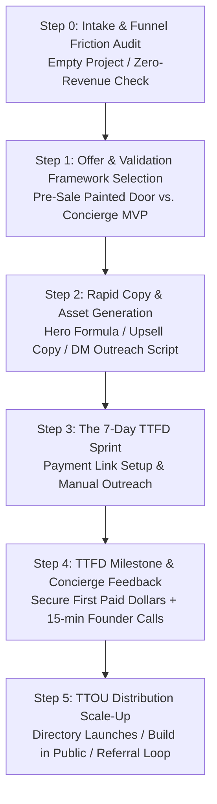

# /wf-launch — App Launch & Fast Validation Pipeline

The official App Launch & Fast Validation workflow for Workforces. Brought in whenever a project is empty, newly scaffolded, or has made zero dollars in revenue. Relentlessly drives **Time to First Dollar (TTFD)** and scales distribution to **Time to 100 Users (TTOU)** before building complex software.

Orchestrated by the **Launch Specialist** (`@launcher`) in close collaboration with `@marketer`, `@growth`, `@programmer`, and `@sales`.

---

## 🧭 Workflow Overview



---

## 💬 Usage

```bash
/wf-launch              # Run the interactive launch & validation pipeline
/wf-launch --ttfd       # Focus on the 7-Day Sprint to First Dollar
/wf-launch --ttou       # Focus on scaling distribution to 100 active users
/wf-launch --audit      # Diagnose waitlist friction, lead decay, and pricing in active project
/wf-launch --presale    # Set up Pre-Sale Painted Door rails (Stripe links / SetupIntent)
/wf-launch --concierge  # Blueprint Concierge MVP manual fulfillment workflow
/wf-launch --copy       # Generate landing page hero, thank-you upsell, and DM scripts
```

---

## 🛠️ Required Skills

Before initiating `/wf-launch`, verify the following skills are available:
1. **`launch-playbook`** — Core TTFD/TTOU metrics, funnel audit tables, pre-sale rails, and copy formulas.
2. **`market-validation`** — Alberto Savoia pretotyping, Skin-in-the-Game ladder, and Mom Test discovery.
3. **`hypothesis-tracker`** — Falsifiable experiment registration via `hypothesis.py`.
4. **`business-frameworks`** — Jobs-to-be-Done (JTBD) and Value Stick dynamics.
5. **`task-tracker`** — Task reporting and session lineage via `report-task.py`.

---

## 📋 Step-by-Step Execution Pipeline

---

### Step 0 — Intake & Funnel Friction Audit (`@launcher`)

`@launcher` reviews the current project state:
1. **Revenue Status:** Has this project collected \$1 or more from a customer?
   - If \$0: The project is strictly under the **Fast Validation Mandate**. No premature backend architecture, auth rewrites, or multi-tier billing may be built.
2. **Funnel Friction Check:**
   - Are we planning a standard free waitlist? *(Risk: 80% lead decay within 7 days).*
   - Are we attempting a $100 ad test to collect 3–6 free emails? *(Risk: statistically insignificant sample).*
   - Are we proposing 3 pricing tiers ($10 / $99 / $500)? *(Risk: decision paralysis for unreleased software).*
3. **The High-Velocity Prescription:**
   - Eliminate 3-tier pricing $\rightarrow$ Replace with **Single Founder Lifetime Access ($29–$49)** capped at 25–50 users.
   - Eliminate silent "Launching Soon" page $\rightarrow$ Add **immediate cash offer / card hold on confirmation page**.

---

### Step 1 — Select the Validation Framework (`@launcher` & `@programmer`)

Choose one of two high-velocity execution rails:

#### Framework A: The Pre-Sale "Painted Door"
Test true purchasing intent before writing production backend code:
1. **Call to Action (CTA):** `"Join the Founding Cohort — $29 (One-Time)"`
2. **Payment Rail Setup:**
   - **Option 1 (Direct Payment):** Upfront payment via Stripe Payment Link with clear delivery date and 100% money-back guarantee.
   - **Option 2 (Stripe SetupIntent / Card Hold):** Tokenize and save customer card without immediate capture; charge upon delivery.
   - **Option 3 (Honest Painted Door):** Route checkout button to a capacity notification modal:
     > *"We've temporarily capped this beta cohort to ensure 1-on-1 support. Enter your email below to reserve your 50% discount priority when the next slot opens."*

#### Framework B: The Concierge MVP (Wizard of Oz)
Deliver the product outcome manually before writing software:
- Deliver hooks, reports, scraping, or audits by hand within 2 hours of payment.
- Validates that customers care about the **outcome**, not the software UI.

---

### Step 2 — Rapid Asset & Copy Generation (`@marketer` & `@sales`)

Generate conversion assets using the tactical copy formulas:

#### 1. Landing Page Hero Copy
- **Headline Formula:** `Achieve [Desirable Outcome] without [Major Pain Point] in [Timeframe].`
  - *Example:* "Audit your website for SEO issues in 60 seconds without complex enterprise software."
- **Subheadline:** Explain how it works in plain, jargon-free English.
- **Primary CTA:** `Reserve Founder Access — $49 (Normally $199)`
- **Risk Reversal:** `30-day no-questions-asked refund guarantee.`

#### 2. Thank-You Page Upsell Copy
If collecting emails upfront, upsell immediately on confirmation:
> **You're on the list! But wait...**  
> We are onboarding our private beta in cohorts of 25 users.  
> Want to skip the queue and lock in Lifetime Access for **$49** (regularly $15/month)?  
> **[Claim Founder Pass — Instant Access Next Week]**  
> *(Offer limited to the first 25 signups)*

#### 3. Direct Outreach DM Script
For prospective customers complaining about the problem on social channels:
> *"Hey [Name], saw your post about [pain point]. I'm actually wrapping up a small tool that [solves specific pain point in X way].*  
> *I'm letting 10 early testers in this Friday at a heavily discounted rate in exchange for honest feedback. If you're interested, happy to share the link or show you how it works—no pressure either way!"*

---

### Step 3 — The 7-Day TTFD Sprint (`@launcher`)

Execute the day-by-day protocol:

| Day | Milestone | Action Items |
| :--- | :--- | :--- |
| **Day 1** | **Positioning & Lander** | Define target persona + pain point. Deploy 1-page landing page (Carrd / Framer / HTML). |
| **Day 2** | **Payment Rails** | Set up Stripe Payment Link for single $49 Founder Lifetime offer. |
| **Day 3–4** | **Manual Outreach** | Identify 50 people complaining about the problem on X, Reddit, or LinkedIn. Send 50 personalized DMs. Aim for first 1–3 pre-sales. |
| **Day 5** | **Micro Ad Test** | Run $50–$100 hyper-targeted ad campaign (Reddit subreddits or Meta niche interest). Measure CPC and purchase intent. |
| **Day 6–7** | **Delivery & Feedback** | Deliver outcome manually (Concierge MVP) or via lightweight prototype. Conduct 15-min feedback calls with every buyer. |

---

### Step 4 — PM Gatekeeping & TTFD Milestone (`@launcher` & `@project-manager`)

Evaluate the 7-day sprint results:
- **TTFD Achieved ($\ge 1$ Paid Customer):** Proceed to Step 5 (TTOU Scale-Up) and unblock initial backend MVP build.
- **Strong Intent (SetupIntent holds / high painted door clicks):** Refine pricing or delivery timeframe, re-test 72 hours.
- **Zero Purchase Intent (0 sales after 50 DMs + $100 ad test):** Terminate or pivot idea before writing software.

---

### Step 5 — Scale to 100 Users (TTOU) (`@growth` & `@marketer`)

Once TTFD is proven, execute the 4-channel distribution engine:
1. **Directory Launches:** Submit to Product Hunt, Betalist, MicroLaunch, 1000Tools, and relevant subreddits (`r/SideProject`, `r/IndieHackers`).
2. **Founder-Led Content:** Share transparent metrics, customer quotes, and lessons learned on X and LinkedIn.
3. **Incentivized Referrals:** Deploy 1 free month or a 20% recurring commission (via Rewardful/Tolt) for customer referrals.
4. **Programmatic Cold Outreach:** Scrape targeted leads with Apollo/Clay and send personalized audit/concierge offers.
