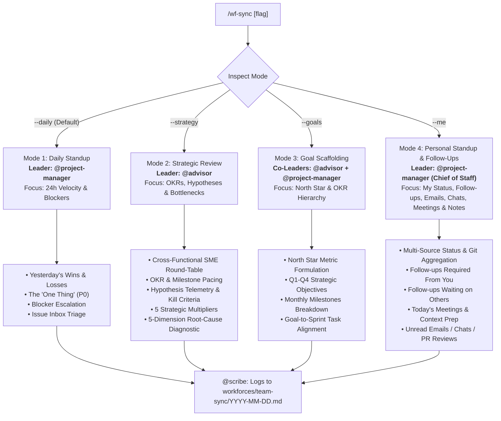

# /wf-sync — Multi-Mode Team Sync & Strategic Alignment

A unified meeting engine for daily execution, strategic course-correction, goal scaffolding, hypothesis tracking, and personal follow-up intelligence. Led dynamically by `@project-manager` (for execution standups & personal syncs) or `@advisor` (for strategic reviews and diagnostics).

---

## 🧭 Meeting Modes & Usage

```bash
/wf-sync                # Default: Daily Execution Standup (Led by @project-manager)
/wf-sync --daily        # Explicit: 5-min tactical standup on 24h wins, blockers & "The One Thing"
/wf-sync --strategy     # Strategic Review: OKRs, KPIs, Hypothesis Pacing, SME Round-Table (Led by @advisor)
/wf-sync --goals        # Goal & Milestone Scaffolding: Setup/reset Annual North Star & Q1-Q4 OKRs
/wf-sync --me           # Personal Standup & Follow-Up Radar: Tasks, Git, Follow-ups, Emails, Messages, Meetings & Notes
```

---

## 🚦 Meeting Router & Leadership Matrix



---

# Mode 1: Daily Execution Standup (`/sync --daily`)

**Meeting Leader:** `@project-manager`  
**Duration Target:** 2–5 minutes  
**Primary Goal:** Unblock the team, lock in today's single most critical commitment, and triage incoming issues.

### Step D1 — Ingest Daily State
1. Read `workforces/workstate.md` for active, pending, and completed sprint tasks.
2. Read `workforces/issues/inbox/` for new bugs, tech debt, or spontaneous ideas logged by agents or user.
3. Check GitHub queue (`gh pr list`, `gh issue list`) for external PR review requests.

### Step D2 — Review 24h Wins & Roadblocks
- **🏆 Wins:** What was marked completed in `workstate.md` since the last standup?
- **⚠️ Roadblocks:** What tasks are currently stalled, waiting on credentials, or blocked by API dependencies?

### Step D3 — Lock In "The One Thing"
- Identify the single highest-leverage task for today (**P0 Priority**).
- Verify that every active team has exactly one primary focus.

### Step D4 — Triage Issue Inbox
- Review pending files in `workforces/issues/inbox/*.md`.
- Promote P0/P1 items to `workstate.md` and GitHub Issues.
- Move triaged files to `workforces/issues/triaged/` or `workforces/issues/completed/` (if rejected).

### Step D5 — Present Standup Report
```markdown
## 🔄 Daily Standup — YYYY-MM-DD

### 🏆 24h Wins
- [x] Task A — Description of achievement.

### ⚠️ Roadblocks & Immediate Blockers
- [ ] Task B — Blocked on staging OAuth domain verification (@programmer).

### 🎯 The One Thing Today
> **[Task C Title]** (Priority P0 — Owner: `@programmer`)
> *Why:* Critical path item blocking revenue milestone.

### 📬 Inbox Triage
- Triaged 2 items (1 promoted to P1, 1 logged to backlog).

### 🙋 Help Needed from User
- Approval for staging API key configuration.
```

---

# Mode 2: Strategic Review, Brainstorming & Hypothesis Discovery (`/sync --strategy`)

**Meeting Leader:** `@advisor` (Co-pilot: `@project-manager`)  
**Duration Target:** 10–15 minutes  
**Primary Goal:** Brainstorm high-leverage opportunities for the next cycle, extract winning ideas into falsifiable hypotheses, enforce factual telemetry grounding, explore tool & subagent delegation (Jules, Copilot, Stitch, Flow/Vids/Slides), audit OKR pacing, and enforce kill/pivot criteria.

### Step S1 — Ingest Factual Business State & Grounding
1. **Factual Telemetry Grounding:** Enforce the zero-hallucination rule. Check verified outreach logs, commit history, and analytics. If no customer outreach or ad campaigns have run, record the factual baseline (`0 outreach calls / 0 live ads; pre-launch stage`).
2. **Strategic Goals:** Read `workforces/goals/` for current quarter objectives and key results.
3. **Active Hypotheses:** Query `skills/hypothesis-tracker/scripts/hypothesis.py --review` for active experiments in `workforces/hypotheses/running/`.
4. **Velocity & Backlog:** Read `workforces/workstate.md` for completed vs backlog tasks and async worker statuses.
5. **Design Feedback Memory:** Read `workforces/memory/design-preferences.md` for negative constraints and approved aesthetic preferences.

### Step S2 — Factual Team Status & Advisor Strategic Inquiry
Domain agents report ONLY verified historical data. `@advisor` then actively queries each department with sharp consultative probes:

```markdown
### 🎙️ Factual Status & Strategic Inquiry Round-Table
- **💼 Sales (`@sales`):**
  - *Factual Telemetry:* 0 prospect outreach calls completed to date (pre-launch / baseline stage).
  - *Advisor Probe:* "Who is the single most desperate buyer archetype in our target market, and what specific pain hook will get an immediate reply once we launch outbound?"
- **📈 Marketing & Growth (`@marketer` / `@growth`):**
  - *Factual Telemetry:* Organic search protocols live; 0 ad spend deployed.
  - *Advisor Probe:* "What high-converting content formats (e.g. interactive ROI calculators, short-form video teardowns) can we test next cycle to drive organic acquisition?"
- **💻 Engineering (`@programmer`):**
  - *Factual Telemetry:* Core MVP build passing 100% tests; auth service refactor complete.
  - *Advisor Probe:* "What parts of the upcoming feature backlog can be offloaded to async coding workers like Google Jules or GitHub Copilot to accelerate delivery?"
- **🎨 Design (`@designer`):**
  - *Factual Telemetry:* Tokens aligned with `design-preferences.md` (0 yellow on light/white).
  - *Advisor Probe:* "What interactive visual prototypes or design variations should we iterate internally before presenting to human review?"
```

### Step S3 — Cross-Functional Brainstorming & Idea Extraction (Loop Process)
The team engages in a structured brainstorming loop to extract winning ideas for the next cycle:
1. **Unpack Market Assumptions:** Identify speculative ideas (e.g. *"Solo agents want 1-touch mobile checkout"* or *"Brokers want audit compliance dashboards"*).
2. **Convert to Falsifiable Hypotheses:** Convert every speculative assumption into a structured experiment using `hypothesis.py --create`:
   - Define Owner (`@sales`, `@marketer`, `@growth`, `@programmer`, `@designer`)
   - Define Falsifiable Statement
   - Define Leading Indicators (e.g. discovery calls booked, prototype signups) and Lagging Indicators (e.g. paid conversions)
   - Define Kill / Pivot Thresholds
   - Attach Recommended Tools (e.g. `google-vids`, `google-stitch`, `jules`) and GitHub labels (`tool:...`, `type:hypothesis`)
3. **Capture Product / Technical Ideas:** Log technical or UX feature ideas into `workforces/issues/inbox/` using `report-issue.py --title "..." --type idea --tools "..." --sync-session`.

### Step S4 — Dynamic Tool Enablement & Delegation Inquiry
`@advisor` probes the team on tool acceleration opportunities:
> *"What tools, async subagents, or external systems (e.g. Google Jules / GitHub Copilot for dev, Google Stitch for UI, Google Flow/Vids/Slides for marketing, ad/analytics MCPs) could take work off your plate or 10x your throughput next cycle?"*

- **Identified Tooling & Delegation Requests:**
  - **Dev:** Delegate async refactoring tasks to Google Jules (`jules remote list --session`) or GitHub Copilot PRs (`delegated_to: jules`, label: `tool:jules`).
  - **Marketing:** Leverage Google Flow / Google Vids / Google Slides for autonomous video script and presentation drafting (`tool:google-vids`).
  - **Design:** Leverage Google Stitch or Figma MCP for rapid token and component scaffolding (`tool:google-stitch`).

### Step S5 — Scientific Hypothesis & Experiment Review (Kill / Pivot Enforcer)
Run `python3 skills/hypothesis-tracker/scripts/hypothesis.py --review`:
- Audit weekly pacing on leading and lagging indicators for all running experiments.
- **Kill Criteria Enforcement:** If an experiment elapsed time is up and metrics breached the kill threshold:
  > *"🚨 **Kill Criteria Triggered:** Experiment `HYP-20260823-01` achieved 2.1% reply rate vs. 3% kill threshold. Recommending immediate sunset and pivoting resources."*

### Step S6 — Goal & OKR Pacing Analysis
Compare progress against quarterly key results and calculate the **Goal Alignment & Coverage Index**:

| Goal / Key Result | Target | Current | Pacing | Goal Coverage | Linked Tasks / Hypotheses |
|:---|:---|:---|:---|:---|:---|
| **KR 1:** Acquire 25 pilot accounts | 25 | 0 (Pre-launch) | 🟡 In Setup | ✅ Covered | HYP-01 (Outbound Test), 2 sprint tasks |
| **KR 2:** Launch core MVP platform | 100% | 85% | 🟢 On Track | ✅ Covered | 3 sprint tasks |

### Step S7 — The 4-Step Executive Decision Sequence & Strategic Multipliers
`@advisor` and `@project-manager` audit the upcoming strategic roadmap against the **4-Step Decision Sequence (`skills/business-frameworks`)**:

1. **JTBD & Customer Validation**: Verify all proposed features and outreach campaigns state explicit situational triggers and 3D jobs (Functional, Emotional, Social) rather than demographic assumptions.
2. **Value Stick Audit**: Verify initiatives lengthen the total value stick (expanding customer **WTP** via delight or lowering partner/vendor **WTS** via tooling) rather than extracting zero-sum margin.
3. **Growth Loops & Platform Dynamics**: Map initiatives into closed compounding feedback loops (viral, UGC, paid reinvestment, marketplace) and direct/indirect network effects.
4. **Unit Economics & Execution (Sense-Seize-Transform)**:
   - **Economic Hurdles**: Verify projected $\text{LTV:CAC} \ge 3.0\times$ and $\text{CAC Payback} < 12\text{ months}$.
   - **Theory of Constraints**: Identify the single system bottleneck across Dev, Design, Sales, Marketing, or Operations.
   - **Kill Criteria Enforcement**: Sunset experiments breaching kill thresholds via `hypothesis.py --kill`.
   - **Decision Log & Lineage**: Explicitly record pivots and rationale in `workforces/team-sync/` and active session notes.

### Step S8 — Autonomous AI Execution Roadmap with Human Approval Gates
Clearly demarcate what AI will execute autonomously next cycle vs. what requires human direction:

```markdown
## 🧭 Strategic Review & Next-Cycle Action Plan — YYYY-MM-DD

### 💡 Brainstormed Hypotheses & Experiments for Next Cycle
- [ ] **HYP-01 (@sales):** Test 50 personalized problem-first emails to solo agents. [Tools: email-crm, Label: `tool:sales-outreach`]
- [ ] **HYP-02 (@marketer):** Test 3 video problem teasers for Instagram/TikTok. [Tools: google-vids, Label: `tool:google-vids`]

### 🧰 Tool Enablement & Async Delegation Requests
- **Dev:** Assign auth token cache refactor to Google Jules (`jules remote list --session`, Label: `tool:jules`, `delegated:jules`).
- **Marketing:** Enable Google Vids / Slides integration for automated video generation.

### 🤖 Autonomous AI Next-Cycle Execution (No Human Intervention Needed)
1. `@programmer`: Execute sprint tasks #12–#14, run test suites, and review Jules patch for auth refactor.
2. `@designer`: Run multi-pass self-iterations on mobile checkout layout against `design-preferences.md`.
3. `@marketer`: Draft 3 video scripts and prepare social distribution schedule.

### 🙋 Human Approval & Direction Gates (Your Decision Needed)
1. Approve launching Hypothesis HYP-01 and HYP-02.
2. Review final UI design options once `@designer` completes internal iteration passes.
```

---

# Mode 3: Goal & Milestone Scaffolding (`/sync --goals`)

**Meeting Leaders:** `@advisor` (Strategic Discovery) + `@project-manager` (Scaffolding & Milestone Sequencing)  
**Primary Goal:** Establish or reset company goals, annual North Star, quarterly OKRs, and monthly milestones when `workforces/goals/` is empty or at quarter boundaries.

### Step G1 — North Star Discovery
`@advisor` asks 2 targeted consultative questions:
1. *"What is the single North Star metric that defines company success for the next 12 months? (e.g. $50k MRR, 10,000 active users, 50 enterprise pilots)"*
2. *"What are the 2–3 core pillars required to hit that number? (e.g. Acquisition engine, Product retention, Enterprise compliance)"*

### Step G2 — Scaffold Quarterly OKRs
Generate `workforces/goals/YYYY_QX_goals.md` using `skills/workforce-management/templates/goal-template.md`:
- 2–3 Objectives with 2–3 quantifiable Key Results each.
- Assign an owning team (`@sales`, `@growth`, `@programmer`, etc.) to each KR.

### Step G3 — Break Down Monthly Milestones
Structure the quarter into 3 monthly milestone gates (Month 1 Foundation, Month 2 Funnel Acceleration, Month 3 Scale).

### Step G4 — Seed Initial Sprint Backlog
`@project-manager` turns Month 1 milestones into initial P0/P1 tasks in `workforces/workstate.md` with full goal lineage.

---

# Mode 4: Personal Standup & Follow-Up Radar (`/sync --me`)

**Meeting Leader:** `@project-manager` (operating as your proactive AI Chief of Staff) co-piloting with `@scribe`  
**Duration Target:** 2–3 minutes  
**Primary Goal:** Roll up your personal in-flight work, surface high-priority incoming asks and follow-ups required from you, track pending items you are waiting on, synthesize today's meetings with automated context prep, and pull recent active notes across all connected tools and MCPs.

---

### 🔍 Autonomous Multi-Source Tool Ingestion & Discovery

The AI dynamically inspects available workspace state, CLI utilities, and connected MCP servers to build your personal intelligence briefing:

1. **Local State & Git Aggregator (`personal_sync.py`):**
   Execute the fast multi-source aggregator:
   ```bash
   python3 .agents/skills/task-tracker/scripts/personal_sync.py --root ./ --format markdown
   ```
   *(Fallback: `python3 skills/task-tracker/scripts/personal_sync.py --root ./ --format markdown`)*
   - **Git Workspace:** Active branch, modified/staged files (`git status --porcelain`), recent commit log (`git log -n 5`).
   - **Active Tasks:** `workforces/tasks/` filtered for `in_progress`, `blocked`, and high-priority `todo` tasks.
   - **Sprint State:** `workforces/workstate.md` active sprint tasks and roadblocks.
   - **Session Context:** Latest session note in `workforces/session-context/` for active decisions and topics.
   - **GitHub Queue (via `gh` CLI):** PR review requests (`review-requested:@me`), assigned issues (`assignee:@me`), and authored open PRs.
   - **Async Coding Workers:** Active Google Jules sessions (`jules remote list --session`, excluding completed).

2. **Communication & Calendar Ingestion (Lazy MCP Tools):**
   - **Emails (`ms-teams-email` MCP):** Call `email_list_messages` (or unread / recent inbox) to detect urgent unreplied emails addressed to you, client questions, or pending approvals.
   - **Messages & Chats (`ms-teams-email` MCP / Teams):** Call `teams_list_chats` and `teams_get_chat_messages` to check recent 1-on-1s, direct mentions (`@mention`), or questions awaiting your reply.
   - **Meetings & Calendar:** Check today's scheduled meetings/events (via `ms-teams-email` / Graph / calendar tools). Match each meeting's topic and attendees with relevant active tasks, recent PRs, or session context notes to provide **proactive meeting prep**.

3. **Knowledge & Notes Ingestion (Lazy MCP Tools):**
   - **Notion (`notion-mcp-server` MCP):** If connected, query `API-post-search` for recent pages, daily notes, or personal task databases.

> [!NOTE]
> **Resilient Tool Discovery:** The AI automatically queries whichever tools and MCPs are available and active in your environment. If a tool or MCP is offline or unconfigured, the AI gracefully skips it without crashing and transparently reports which sources were audited.

---

### Step M1 — Classify & Synthesize Follow-ups

Categorize all discovered items into clear, actionable buckets:
- **What You Are Working On:** Current focus, active branch, in-progress tasks, recent decisions.
- **High-Priority Follow-ups Required From You:**
  - Unanswered emails or chat messages requiring your decision or reply.
  - GitHub PR review requests awaiting your approval.
  - Blocked tasks where the team or agents are waiting on your input or credentials.
- **Follow-ups You Are Waiting On:**
  - PRs authored by you awaiting review from others.
  - Sent proposals, emails, or messages waiting on a response.
  - Active hypotheses waiting on live telemetry or pacing triggers.
- **Today's Meetings & Prep Context:**
  - Time, Meeting Title, Attendees.
  - Relevant active tasks, recent decisions, or PR links to reference in the call.
- **Active Notes & Ideas:**
  - Key decisions from recent session context notes and captured P1/P2 ideas.
- **The "One Thing" for You Today:**
  - The single highest-leverage commitment to move your goals forward.

---

### Step M2 — Present Personal Briefing

Present the structured briefing to the user in chat:

```markdown
## 👤 Personal Sync & Follow-Up Radar (`/sync --me`) — YYYY-MM-DD

### 🔨 What You Are Working On (Active Focus)
- **Git Workspace:** Branch `feature/auth-refactor` (2 modified files)
  - *Latest Commit:* `a1b2c3d - Add JWT refresh token rotation (2h ago)`
- **In-Progress Task:** [Implement OAuth Callback Handler](file:///path/to/workforces/tasks/task-01.md) (`task` | **P0**)
  - *Next Action:* Finish unit test suite and verify token expiration handling.
- **Active Session Topic:** Next-Gen Meeting Sync & Hypothesis Engine (#027)

### 🚨 High-Priority Follow-ups Required From You (Action Needed)
- **📬 Unanswered Emails / Messages:**
  - John Doe (Partner) — *"Updated API contracts for review"* (Received: 9:15 AM — Action: Reply with confirmation)
  - Sarah (Design) — *"Question on mobile navigation styling"* (Teams DM — Action: Confirm bottom bar layout)
- **🔍 PR Reviews Awaiting Your Approval:**
  - [PR #42: Add Stripe Webhook Handler](https://github.com/org/repo/pull/42) by `@developer`
- **⚠️ Blocked Tasks:**
  - Task #8: Staging deploy blocked on AWS credentials approval.

### ⏳ Follow-ups You Are Waiting On (Pending Counterparties)
- **Authored PRs Awaiting Review:**
  - [PR #39: Refactor Database Models](https://github.com/org/repo/pull/39) (Waiting on `@reviewer` — Open 2 days)
- **Active Running Hypotheses:**
  - `HYP-01`: Outbound Sales Email Test (Owner: `@sales` — Pacing check in 3 days)

### 📅 Today's Meetings & Proactive Prep
- **11:00 AM — Pilot Architecture Review** with *Engineering Team*
  - *Prep Context:* Review [PR #39](https://github.com/org/repo/pull/39) and Session Note #027 decisions.
- **2:30 PM — Growth Sync** with *Marketing Lead*
  - *Prep Context:* Check `HYP-01` baseline telemetry.

### 📝 Active Notes & Key Decisions
- **Recent Decision:** Collapsed dual status/triage into a unified 5-state lifecycle (`todo`, `in_progress`, `blocked`, `done`, `dropped`).
- **Recent Idea:** Explore automated calendar prep agent for morning standups.

### 🎯 The One Thing for You Today
> **Complete the OAuth Callback Handler (Task #1)**
> *Why:* Critical path P0 item unblocking staging deployment and team integration.
```

---

### Step M3 — Optional State Logging

If requested or approved by the user:
- `@scribe` saves the personal briefing record to `workforces/team-sync/YYYY-MM-DD-me.md`.
- Synchronize active tasks in `workforces/tasks/` and active session context note in `workforces/session-context/`.

---

## 📝 Logging & State Preservation

After the user approves the sync summary:
1. **Save Log:** `@scribe` writes the approved record to `workforces/team-sync/YYYY-MM-DD.md` (or `YYYY-MM-DD-strategy.md` / `YYYY-MM-DD-me.md`).
2. **Update Workstate:** Synchronize `workforces/workstate.md` task priorities and statuses.
3. **Update Hypotheses:** Transition any killed, validated, or updated hypotheses via `hypothesis.py`.
4. **Preserve Lineage:** Update active session context note in `workforces/session-context/`.
